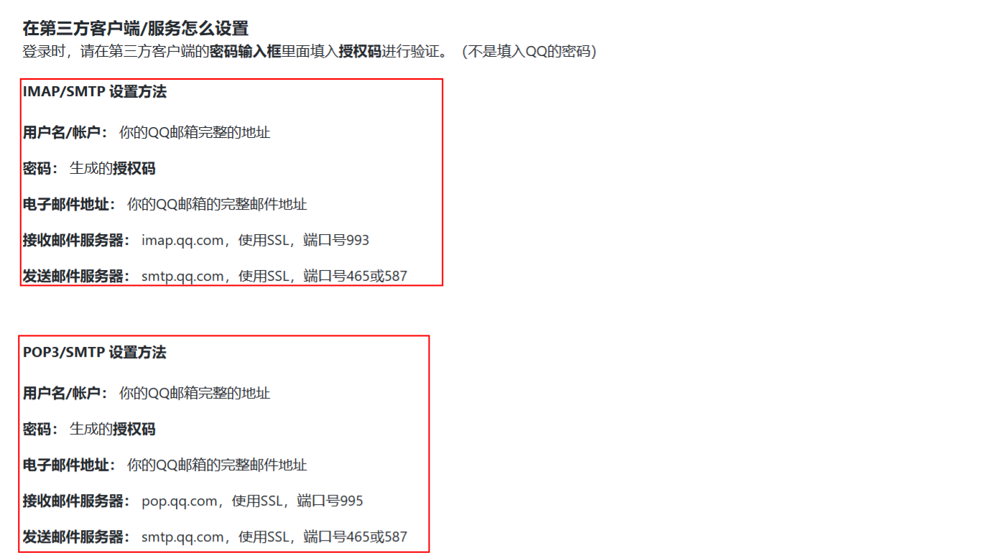
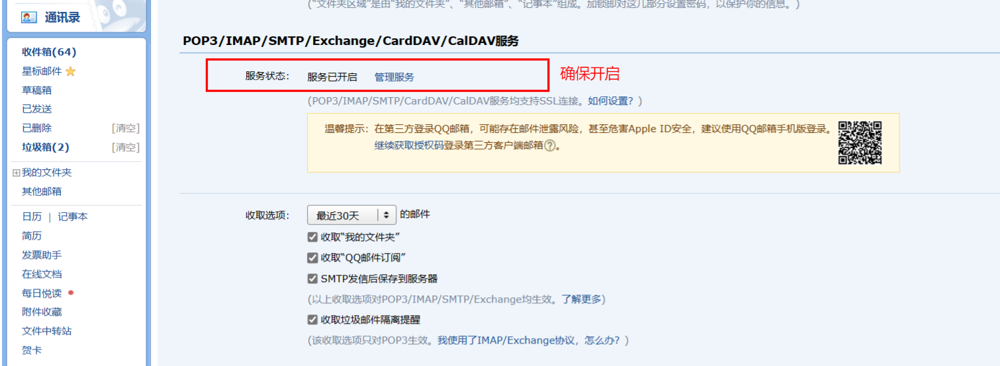
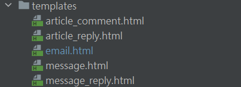
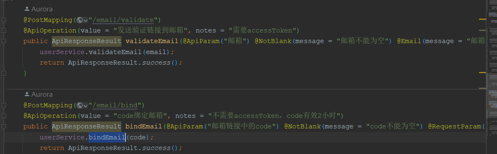

# EmailService

> 邮件服务

## 开通邮箱SMTP服务

qq邮箱官网:  [SMTP/IMAP服务 (qq.com)](https://wx.mail.qq.com/list/readtemplate?name=app_intro.html#/agreement/authorizationCode)





## 依赖导入

```xml
<!-- email依赖 -->
<dependency>
  <groupId>org.springframework.boot</groupId>
  <artifactId>spring-boot-starter-mail</artifactId>
</dependency>
<!--   Thymeleaf模板引擎, 用来发起邮箱内容html-->
<dependency>
    <groupId>org.springframework.boot</groupId>
    <artifactId>spring-boot-starter-thymeleaf</artifactId>
</dependency>
```

```yacas
spring:
  mail:
    host: smtp.qq.com
    port: 465
    username: 1665834268@qq.com
    password: //授权码
    protocol: smtp
    default-encoding: UTF-8
    jndi-name: 悦读博客
    properties:
      mail:
        smtp:
          ssl:
            enable: true

// check为邮箱绑定的服务地址
mail:
  check: http://localhost:9000/email/bind  #验证邮箱url请求
```

## 发起的html内容



email.html

```html
<!doctype html>
<html lang="zh" xmlns:th="http://www.thymeleaf.org">
<html>
<head>
    <meta content="width=device-width" name="viewport">
    <meta content="text/html; charset=UTF-8" http-equiv="Content-Type">
    <title>悦读博客邮箱验证</title>
    <style>
        /* -------------------------------------
            INLINED WITH htmlemail.io/inline
        ------------------------------------- */
        /* -------------------------------------
            RESPONSIVE AND MOBILE FRIENDLY STYLES
        ------------------------------------- */
        @media only screen and (max-width: 620px) {
            table[class=body] h1 {
                font-size: 28px !important;
                margin-bottom: 10px !important;
            }

            table[class=body] p,
            table[class=body] ul,
            table[class=body] ol,
            table[class=body] td,
            table[class=body] span,
            table[class=body] a {
                font-size: 16px !important;
            }

            table[class=body] .wrapper,
            table[class=body] .article {
                padding: 10px !important;
            }

            table[class=body] .content {
                padding: 0 !important;
            }

            table[class=body] .container {
                padding: 0 !important;
                width: 100% !important;
            }

            table[class=body] .main {
                border-left-width: 0 !important;
                border-radius: 0 !important;
                border-right-width: 0 !important;
            }

            table[class=body] .btn table {
                width: 100% !important;
            }

            table[class=body] .btn a {
                width: 100% !important;
            }

            table[class=body] .img-responsive {
                height: auto !important;
                max-width: 100% !important;
                width: auto !important;
            }
        }

        /* -------------------------------------
            PRESERVE THESE STYLES IN THE HEAD
        ------------------------------------- */
        @media all {
            .ExternalClass {
                width: 100%;
            }

            .ExternalClass,
            .ExternalClass p,
            .ExternalClass span,
            .ExternalClass font,
            .ExternalClass td,
            .ExternalClass div {
                line-height: 100%;
            }

            .apple-link a {
                color: inherit !important;
                font-family: inherit !important;
                font-size: inherit !important;
                font-weight: inherit !important;
                line-height: inherit !important;
                text-decoration: none !important;
            }

            #MessageViewBody a {
                color: inherit;
                text-decoration: none;
                font-size: inherit;
                font-family: inherit;
                font-weight: inherit;
                line-height: inherit;
            }

            .btn-primary table td:hover {
                background-color: #34495e !important;
            }

            .btn-primary a:hover {
                background-color: #34495e !important;
                border-color: #34495e !important;
            }
        }
    </style>
</head>
<body class=""
      style="background-color: #f6f6f6; font-family: sans-serif; -webkit-font-smoothing: antialiased; font-size: 14px; line-height: 1.4; margin: 0; padding: 0; -ms-text-size-adjust: 100%; -webkit-text-size-adjust: 100%;">
<table border="0" cellpadding="0" cellspacing="0" class="body"
       style="border-collapse: separate; mso-table-lspace: 0pt; mso-table-rspace: 0pt; width: 100%; background-color: #f6f6f6;">
    <tr>
        <td style="font-family: sans-serif; font-size: 14px; vertical-align: top;">&nbsp;</td>
        <td class="container"
            style="font-family: sans-serif; font-size: 14px; vertical-align: top; display: block; Margin: 0 auto; max-width: 580px; padding: 10px; width: 580px;">
            <div class="content"
                 style="box-sizing: border-box; display: block; Margin: 0 auto; max-width: 580px; padding: 10px;">

                <!-- START CENTERED WHITE CONTAINER -->
                <span class="preheader"
                      style="color: transparent; display: none; height: 0; max-height: 0; max-width: 0; opacity: 0; overflow: hidden; mso-hide: all; visibility: hidden; width: 0;">悦读博客邮箱验证</span>
                <table class="main"
                       style="border-collapse: separate; mso-table-lspace: 0pt; mso-table-rspace: 0pt; width: 100%; background: #ffffff; border-radius: 3px;">

                    <!-- START MAIN CONTENT AREA -->
                    <tr>
                        <td class="wrapper"
                            style="font-family: sans-serif; font-size: 14px; vertical-align: top; box-sizing: border-box; padding: 20px;">
                            <table border="0" cellpadding="0" cellspacing="0"
                                   style="border-collapse: separate; mso-table-lspace: 0pt; mso-table-rspace: 0pt; width: 100%;">
                                <tr>
                                    <td style="font-family: sans-serif; font-size: 14px; vertical-align: top;">
                                        <p style="font-family: sans-serif; font-size: 14px; font-weight: normal; margin: 0; Margin-bottom: 15px;">
                                            你好,</p>
                                        <p style="font-family: sans-serif; font-size: 14px; font-weight: normal; margin: 0; Margin-bottom: 15px;">
                                            感谢使用悦读博客。请点击以下链接进行邮箱验证，以便完成悦读博客邮箱绑定。</p>
                                        <a style="display: inline-block; color: #ffffff; background-color: #3498db; border: solid 1px #3498db; border-radius: 5px; box-sizing: border-box; cursor: pointer; text-decoration: none; font-size: 14px; font-weight: bold; margin: 0; padding: 12px 25px; text-transform: capitalize; border-color: #3498db;"
                                           target="_blank"
                                           th:href="@{ ${checkUrl} }">马上验证</a>
                                        <p style="font-family: sans-serif; font-size: 14px; font-weight: normal; margin: 0; Margin-bottom: 15px;Margin-top: 15px;">
                                            如果你并未在悦读博客进行邮箱验证，可能是其他用户误输入了你的邮箱。请忽略此邮件。</p>
                                        <p style="font-family: sans-serif; font-size: 14px; font-weight: normal; margin: 0; Margin-bottom: 15px;">
                                            生活愉快，工作顺利！</p>
                                    </td>
                                </tr>
                            </table>
                        </td>
                    </tr>

                    <!-- END MAIN CONTENT AREA -->
                </table>

                <!-- START FOOTER -->
                <div class="footer" style="clear: both; Margin-top: 10px; text-align: center; width: 100%;">
                    <table border="0" cellpadding="0" cellspacing="0"
                           style="border-collapse: separate; mso-table-lspace: 0pt; mso-table-rspace: 0pt; width: 100%;">
                        <tr>
                            <td class="content-block"
                                style="font-family: sans-serif; vertical-align: top; padding-bottom: 10px; padding-top: 10px; font-size: 12px; color: #999999; text-align: center;">
                                <span class="apple-link" style="color: #999999; font-size: 12px; text-align: center;">©2020 Yaohw 使用悦读博客分享前必读 意见反馈</span>
                            </td>
                        </tr>
                        <tr>
                            <td class="content-block powered-by"
                                style="font-family: sans-serif; vertical-align: top; padding-bottom: 10px; padding-top: 10px; font-size: 12px; color: #999999; text-align: center;">
                                Powered by <a href="http://www.poile.cn"
                                              style="color: #999999; font-size: 12px; text-align: center; text-decoration: none;">悦读博客</a>.
                            </td>
                        </tr>
                    </table>
                </div>
                <!-- END FOOTER -->

                <!-- END CENTERED WHITE CONTAINER -->
            </div>
        </td>
        <td style="font-family: sans-serif; font-size: 14px; vertical-align: top;">&nbsp;</td>
    </tr>
</table>
</body>
</html>
```

## Service

```java
package com.lfj.blog.service.sys.security.biz;


import com.baomidou.mybatisplus.core.toolkit.ArrayUtils;
import lombok.extern.log4j.Log4j2;
import org.springframework.beans.factory.annotation.Value;
import org.springframework.mail.javamail.JavaMailSender;
import org.springframework.mail.javamail.MimeMessageHelper;
import org.springframework.scheduling.annotation.Async;
import org.springframework.stereotype.Service;
import org.thymeleaf.TemplateEngine;
import org.thymeleaf.context.Context;

import javax.annotation.Resource;
import javax.mail.internet.MimeMessage;
import java.util.Map;


/**
 * 邮件服务
 **/
@Service
@Log4j2
public class EmailService {

	@Value("${spring.mail.username}")
	private String from;

	@Value("${spring.mail.jndi-name}")
	private String personal;

	@Resource
	private TemplateEngine templateEngine;

	@Resource
	private JavaMailSender mailSender;

	/**
	 * 异步发送Html邮件
	 *
	 * @param to       发送给谁
	 * @param subject  主题
	 * @param template html模板名
	 * @param params   模板参数
	 * @param cc       抄送到
	 */
	@Async
	public void asyncSendHtmlMail(String to, String subject, String template, Map<String, Object> params, String... cc) {
		try {
			MimeMessage message = mailSender.createMimeMessage();
			MimeMessageHelper helper = new MimeMessageHelper(message, true);
			helper.setFrom(from, personal);
			helper.setTo(to);
			helper.setSubject(subject);
			Context context = new Context();
			context.setVariables(params);
			String emailContent = templateEngine.process(template, context);
			helper.setText(emailContent, true);
			if (ArrayUtils.isNotEmpty(cc)) {
				helper.setCc(cc);
			}
			mailSender.send(message);
			log.info("邮件成功发送到:{}", to);
		} catch (Exception e) {
			log.error("发送邮件失败:{0}", e);
		}
	}

	/**
	 * 发送Html邮件
	 *
	 * @param to       发送给谁
	 * @param subject  主题
	 * @param template html模板名
	 * @param params   模板参数
	 * @param cc       抄送到
	 */
	public void sendHtmlMail(String to, String subject, String template, Map<String, Object> params, String... cc) {
		asyncSendHtmlMail(to, subject, template, params, cc);
	}

	/**
	 * 异步发送Html邮件
	 *
	 * @param to       发送给谁
	 * @param subject  主题
	 * @param template html模板名(xxx.html)
	 * @param params   模板参数
	 */
	@Async
	public void asyncSendHtmlMail(String to, String subject, String template, Map<String, Object> params) {
		String[] cc = new String[0];
		asyncSendHtmlMail(to, subject, template, params, cc);
	}

	/**
	 * 发送Html邮件
	 *
	 * @param to       发送给谁
	 * @param subject  主题
	 * @param template html 模板
	 * @param params   模板参数
	 */
	public void sendHtmlMail(String to, String subject, String template, Map<String, Object> params) {
		asyncSendHtmlMail(to, subject, template, params);
	}
}
```

## Controller



```java
	/**
	 * 发送邮箱验证链接
	 *
	 * @param email
	 * @return void
	 */
	@Override
	public void validateEmail(String email) {
		QueryWrapper<User> queryWrapper = new QueryWrapper<>();
		queryWrapper.lambda().eq(User::getEmail, email);
		long count = count(queryWrapper);
		if (count != 0) {
			throw new ApiException(ResponseCodeEnum.INVALID_REQUEST.getCode(), "邮箱已被使用,请换个绑定");
		}
		// 请求携带token, 可以用任务上下文获得authenticationToken
		AuthenticationToken authenticationToken = ServerSecurityContext.getAuthenticationToken(true);
		Map<String, Object> params = new HashMap<>(1);
		// 生成模板参数
		RandomValueStringGenerator generator = new RandomValueStringGenerator();
		String code = generator.generate();
		String accessToken = authenticationToken.getAccessToken();
		String checkUrl = prefix + "?code=" + code;
		params.put("checkUrl", checkUrl);
		// 服务端生成Redis缓存
		String key = REDIS_MAIL_CODE_PREFIX + code;
		Map<String, String> map = new HashMap<>(2);
		map.put("access_token", accessToken);  //重点
		map.put("email", email);
		stringRedisTemplate.opsForHash().putAll(key, map);
		stringRedisTemplate.expire(key, 2L, TimeUnit.HOURS);
		// 发送邮箱
		emailService.asyncSendHtmlMail(email, "邮箱验证", "email", params);
	}

	/**
	 * 绑定邮箱
	 *
	 * @param code
	 * @return void
	 */
	@Override
	public void bindEmail(String code) {
		Map<Object, Object> resultMap = stringRedisTemplate.opsForHash().
				entries(REDIS_MAIL_CODE_PREFIX + code);
		if (resultMap.isEmpty()) {
			throw new ApiException(ResponseCodeEnum.INVALID_REQUEST.getCode(), "code无效或code已过期");
		}
		String accessToken = (String) resultMap.get("access_token");
		String email = (String) resultMap.get("email");
		stringRedisTemplate.delete(REDIS_MAIL_CODE_PREFIX + code);
		// 请求没有直接携带token, 不能用任务上下文
		AuthenticationToken authToken = tokenStore.readByAccessToken(accessToken);
		if (authToken == null) {
			throw new ApiException(ResponseCodeEnum.INVALID_REQUEST.getCode(), "code无效或code已过期");
		}
		CustomUserDetails principal = authToken.getPrincipal();
		User user = new User();
		Integer userId = principal.getId();
		user.setId(userId);
		user.setEmail(email);
		// 数据库数据更新
		updateById(user);
		// 清空用户缓存
		tokenStore.clearUserCacheById(userId);
	}

```


# OauthService

> 第三方认证