#  第三方登录

## Gitee

### 接入Gitee

登录Gitee后点击头像点击 **设置** -> **第三方应用**，创建要接入码云的应用，填写基本的信息

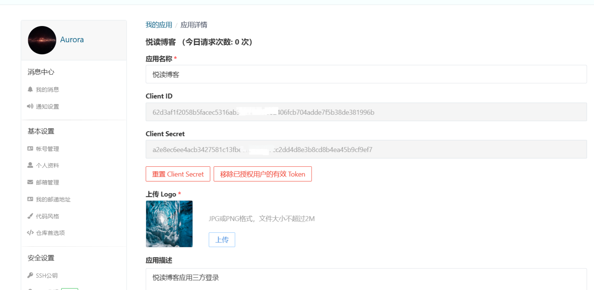

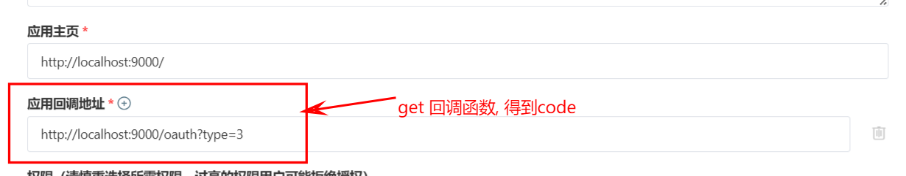

创建应用后会有**Client ID**和**Client Secret**，Client ID是Gitee为每个请求授权的个人或企业提供的唯一ID标识，

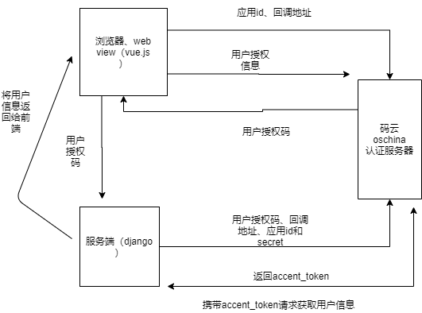

### 参考

[实现Gitee登录](https://blog.csdn.net/qq_41647780/article/details/119616662)

通过GET请求这个地址去获取授权码，{client_id}、{redirect_uri} 填写自己的应用id和回调地址

```
https://gitee.com/oauth/authorize?client_id={client_id}&redirect_uri={redirect_uri}&response_type=code
```

```html
<!DOCTYPE html>
<html lang="en" xmlns:th="http://www.thymeleaf.org">
<head>
    <meta charset="UTF-8">
    <title>index</title>
</head>
<body>
<a href="https://gitee.com/oauth/authorize?client_id={client_id}&redirect_uri={redirect_uri}&response_type=code&state=1">gitee登录</a>
<div>
    <p th:text="${name}"></p>
</div>
<div>
    <p th:text="${user.id}"></p>
</div>
</body>
</html>

```


浏览器输入：localhost 或 http://127.0.0.1/ ，点击gitee登录

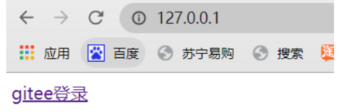

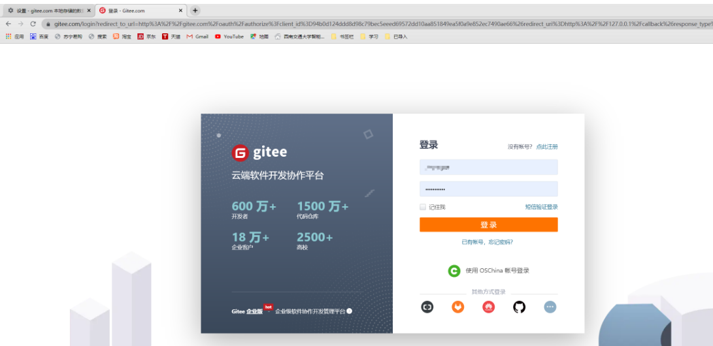

gitee登录、可以页面看到获取到的用户信息
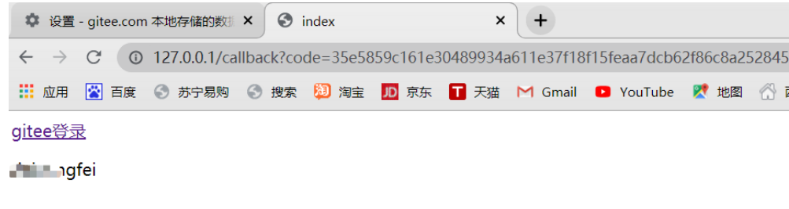

## qq

### `一、登录QQ互联申请为开发者并创建网站应用`

https://connect.qq.com/index.html
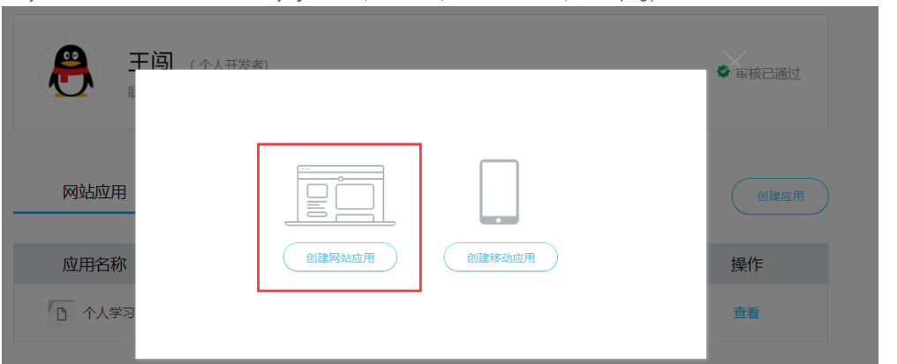

网站名称这儿`必须`填备案好的网站的那个名称！否则不予通过！

申请成功后appid和app key以及网站[回调](https://so.csdn.net/so/search?q=回调&spm=1001.2101.3001.7020)域就能使用：


### `二、放置登录按钮`

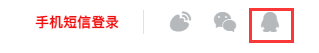
给其加个超链接，通过http去访问一个接口。

### `三、获取Authorization Code值`

请求地址：https://graph.qq.com/oauth2.0/authorize

| 参数                                                        | 是否必须 | 含义                               |
| ----------------------------------------------------------- | -------- | ---------------------------------- |
| response_type                                               | 必须滴   | 写死的，值为“code”                 |
| client_id                                                   | 必须滴   | 你应用的appid                      |
| redirect_uri                                                | 必须滴   | 回调地址                           |
| state                                                       | 必须滴   | client端的状态值（可随意如：test） |
| 成功后返回：                                                |          |                                    |
|  |          |                                    |
| code就是Authorization Code。                                |          |                                    |

### `四、通过Authorization Code获取Access Token`

请求地址：https://graph.qq.com/oauth2.0/token

| 参数                                                         | 是否必须 | 含义                             |
| ------------------------------------------------------------ | -------- | -------------------------------- |
| grant_type                                                   | 必须滴   | 写死的，值为“authorization_code” |
| client_id                                                    | 必须滴   | 你应用的appid                    |
| client_secret                                                | 必须滴   | 你应用的appkey                   |
| code                                                         | 必须滴   | 上一步所获取的code值             |
| redirect_uri                                                 | 必须滴   | 你的回调地址                     |
| 注意（有坑）：grant_type值就为authorization_code（而不是code值！） |          |                                  |
| 成功后返回：                                                 |          |                                  |
| 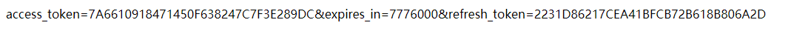  |          |                                  |

### `五、通过Access Token获取openid`

请求地址：https://graph.qq.com/oauth2.0/me

| 参数                                                        | 是否必须 | 含义                         |
| ----------------------------------------------------------- | -------- | ---------------------------- |
| access_token                                                | 必须滴   | 上一步所获取到的access_token |
| 成功后返回：                                                |          |                              |
| 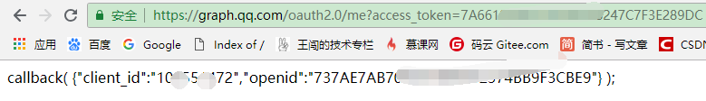 |          |                              |

### `六、通过access_token、appid、openid来获取用户信息`

请求地址（有多个）：https://graph.qq.com/user/get_user_info

| 参数                                                         | 是否必须 | 含义                           |
| ------------------------------------------------------------ | -------- | ------------------------------ |
| access_token                                                 | 必须滴   | 上上一步所获取到的access_token |
| appid                                                        | 必须滴   | 申请成功应用上的appid          |
| openid                                                       | 必须滴   | 上一步所获取到的openid         |
| 成功后返回：                                                 |          |                                |
| 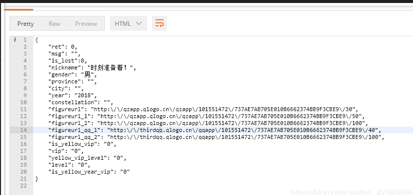 |          |                                |
| 至此，QQ第三方登录就完成了。                                 |          |                                |

—————————————————————————————————————————
下面贴出我的回调地址文件中的代码，之前为了赶速度写的，没有进行优化，很乱，但是最终能返回用户的所有信息：

```php
<?php
$code=$_GET['code'];
function curl($url,$postData=[],$headers=[]){
    $ch=curl_init();
    curl_setopt($ch,CURLOPT_URL,$url);      //要访问的地址
    curl_setopt($ch,CURLOPT_HEADER,0);
    curl_setopt($ch,CURLOPT_RETURNTRANSFER,1);     //执行结果是否被返回，0返，1不返
    curl_setopt($ch,CURLOPT_SSL_VERIFYPEER,false);
    curl_setopt($ch,CURLOPT_SSL_VERIFYHOST,false);
    curl_setopt($ch,CURLOPT_HTTPHEADER,$headers);
    if($postData){
        curl_setopt($ch,CURLOPT_TIMEOUT,60);
        curl_setopt($ch,CURLOPT_POST,1);
        curl_setopt($ch,CURLOPT_POSTFIELDS,$postData);
    }
    if(curl_exec($ch)==false){
        $data='';
    }
    else{
        $data=curl_multi_getcontent($ch);
    }
    curl_close($ch);javascript:;
    return $data;
}
$token=curl("https://graph.qq.com/oauth2.0/token?grant_type=authorization_code&client_id=xxxxxxxxx&client_secret=xxxxxxxxxxx&code=$code&redirect_uri=http://qq.wangchuangcode.cn/callback.php");
$arry = explode('&',$token);
$arr = array_values($arry);
$arrs = $arr[0];
$ar = explode('=',$arrs);
$access_token = $ar[1];
$datas = curl("https://graph.qq.com/oauth2.0/me?access_token=$access_token");

$result ="";
preg_match_all("/(?:\{)(.*)(?:\})/i",$datas, $result);
$opjs = $result[0][0];
$opjson = json_decode($opjs,true);
$client_id = $opjson["client_id"];
$openid = $opjson["openid"];
$appid = 101551472;
$op_return = curl("https://graph.qq.com/user/get_user_info?access_token=$access_token&appid=$appid&openid=$openid");
$opjson = json_decode($op_return,true);
//$opjson是返回的用户所有信息

```


