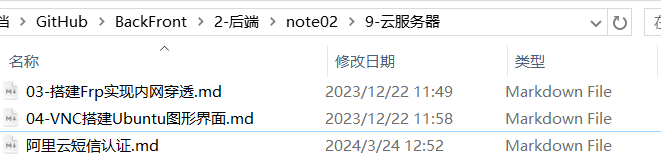
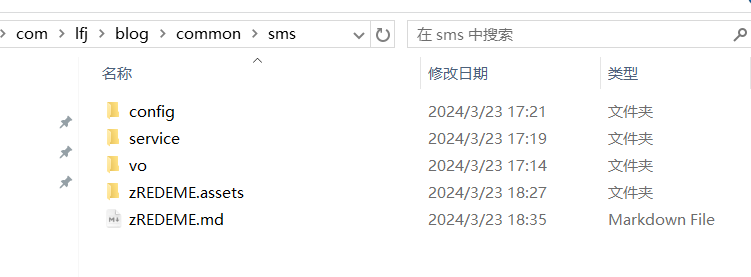
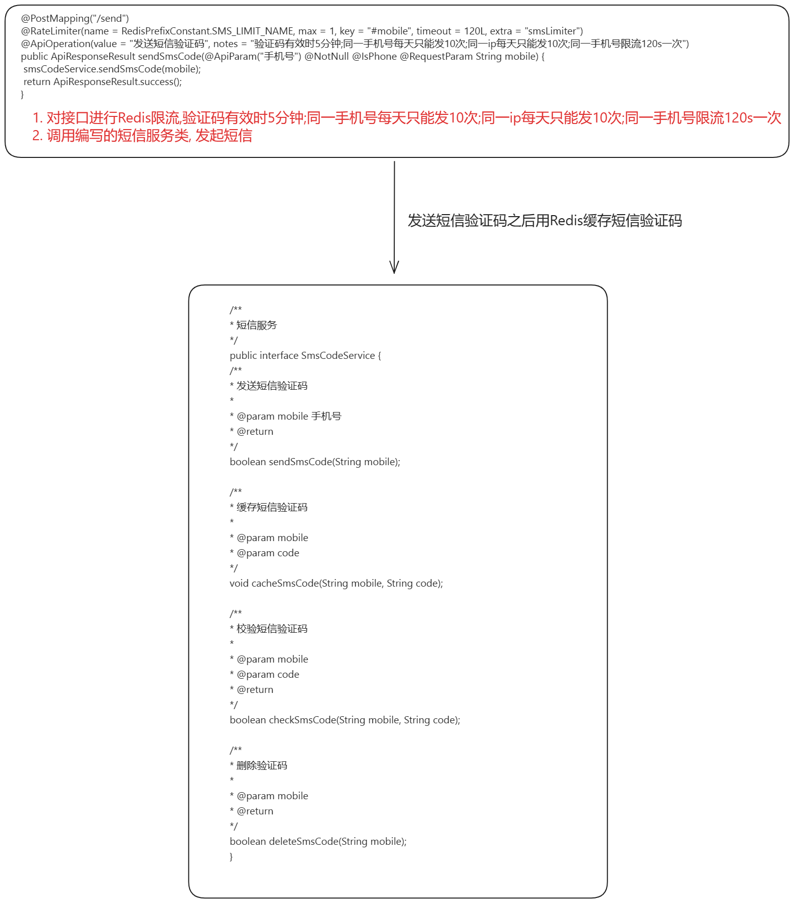
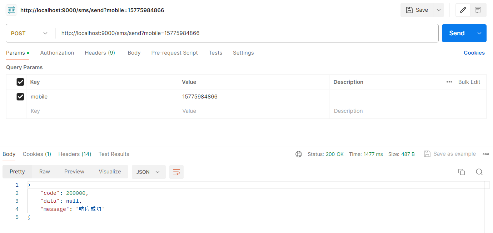

# 手机短信

**阿里云短信配置见**



# 整合

具体代码见:

D:\PCTMoveData\Documents\GitHub\my_blog\blog\src\main\java\com\lfj\blog\common\sms



## 逻辑



## 依赖

```xml
 <!--阿里云 sms sdk 依赖-->
<dependency>
    <groupId>com.aliyun</groupId>
    <artifactId>alibabacloud-dysmsapi20170525</artifactId>
    <version>2.0.23</version>
</dependency>
        <!--redis依赖-->
<dependency>
<groupId>org.springframework.boot</groupId>
<artifactId>spring-boot-starter-data-redis</artifactId>
<version>2.6.3</version>
</dependency>
```

## 配置文件

```yaml
# 手机短信
sms:
  # 短信类型，1：阿里，2：腾讯
  type: 2
  # 短信验证码有效时，单位为:秒
  expire: 300
  # 短信同一手机号最大发送条数
  day_max: 10
  # 阿里短信配置(阿里云平台里看)
  ali:
    regionId: cn-hangzhou         # 地区编号
    accessKeyId: xxxx            # 子用户的访问键
    accessKeySecret: xxx  # 子用户的访问密钥
    signName: 悦读博客              # 签名名称
    templateCode: xxxx    # 登录短信模板的code
  # 腾讯短信配置
  tencent:
    appId: 14001859
    appKey: ea4d97cdc5d23f0741b
    templateId: 608484
    signName: 悦读博客
```

## controller

注意:   对发送短信接口进行redis限流处理 例如

```java

@Log4j2
@RestController
@RequestMapping("/sms")
@Api(tags = "短信验证码服务", value = "/sms")
public class SmsController {

	@Autowired
	private SmsCodeService smsCodeService;

	@Autowired
	private EmailService emailService;

	@PostMapping("/send")
	@RateLimiter(name = RedisPrefixConstant.SMS_LIMIT_NAME, max = 1, key = "#mobile", timeout = 120L, extra = "smsLimiter")
	@ApiOperation(value = "发送短信验证码", notes = "验证码有效时5分钟;同一手机号每天只能发10次;同一ip每天只能发10次;同一手机号限流120s一次")
	public ApiResponseResult sendSmsCode(@ApiParam("手机号") @NotNull @IsPhone @RequestParam String mobile) {
		smsCodeService.sendSmsCode(mobile);
		return ApiResponseResult.success();
	}
}
```

## sms

### vo

```java
package com.lfj.blog.common.sms.vo;

import lombok.AllArgsConstructor;
import lombok.Data;

/**
 * 短信发送结果
 *
 **/
@Data
@AllArgsConstructor
public class SendResult {

	/**
	 * 是否发送成功
	 */
	private boolean success;

	/**
	 * 发送的验证码
	 */
	private String code;
}
```

### config

#### 用于配置文件

```java
package com.lfj.blog.common.sms.config;

import lombok.Data;
import org.springframework.boot.context.properties.ConfigurationProperties;

@Data
@ConfigurationProperties(prefix = "sms", ignoreInvalidFields = true)
public class SmsServiceProperties {

	private final Ali ali = new Ali();
	private final Tencent tencent = new Tencent();
	private int type = 1;
	private long expire = 300L;
	private long dayMax = 10L;

	public SmsServiceProperties() {
	}

	@Data
	public static class Ali {
		private String regionId = "cn-hangzhou";
		private String accessKeyId;
		private String accessKeySecret;
		private String signName;
		private String templateCode;
	}

	@Data
	public static class Tencent {
		private String appId;
		private String appKey;
		private String templateId;
		private String signName;
	}
}

```

#### @bean注解 + 自动读取配置, 选择使用的子类

```java
package com.lfj.blog.common.sms.config;

import com.lfj.blog.common.sms.service.SmsCodeService;
import com.lfj.blog.common.sms.service.impl.ali.AliSmsCodeService;
import com.lfj.blog.common.sms.service.impl.tencent.TencentSmsCodeService;
import lombok.extern.log4j.Log4j2;
import org.springframework.boot.autoconfigure.condition.ConditionalOnMissingBean;
import org.springframework.boot.context.properties.EnableConfigurationProperties;
import org.springframework.context.annotation.Bean;
import org.springframework.context.annotation.Configuration;

/**
 * 短信验证码服务自动配置，默认阿里云短信服务
 **/
@Log4j2
@Configuration
@EnableConfigurationProperties({SmsServiceProperties.class})
public class SmsAutoConfiguration {

	@Bean
	@ConditionalOnMissingBean
	public SmsCodeService smsService(SmsServiceProperties properties) {
		int type = properties.getType();
		if (type == 1) {
			return new AliSmsCodeService(properties);
		}
		return new TencentSmsCodeService(properties);
	}
}
```

注意:  这里使用@bean注入, 也可以使用@server 在使用的时候通过@Resource("xxxxx")指定调用的子类

## server

### SmsCodeService

```java
package com.lfj.blog.common.sms.service;

/**
 * 短信服务
 */
public interface SmsCodeService {
	/**
	 * 发送短信验证码
	 *
	 * @param mobile 手机号
	 * @return
	 */
	boolean sendSmsCode(String mobile);

	/**
	 * 缓存短信验证码
	 *
	 * @param mobile
	 * @param code
	 */
	void cacheSmsCode(String mobile, String code);

	/**
	 * 校验短信验证码
	 *
	 * @param mobile
	 * @param code
	 * @return
	 */
	boolean checkSmsCode(String mobile, String code);

	/**
	 * 删除验证码
	 *
	 * @param mobile
	 * @return
	 */
	boolean deleteSmsCode(String mobile);
}
```

### BaseSmsCodeServiceImpl

```java
package com.lfj.blog.common.sms.service.impl;

import com.baomidou.mybatisplus.core.toolkit.StringUtils;
import com.lfj.blog.common.constant.RedisPrefixConstant;
import com.lfj.blog.common.sms.service.SmsCodeService;
import com.lfj.blog.common.sms.vo.SendResult;
import lombok.Data;
import org.springframework.beans.BeansException;
import org.springframework.beans.factory.InitializingBean;
import org.springframework.context.ApplicationContext;
import org.springframework.context.ApplicationContextAware;
import org.springframework.data.redis.core.StringRedisTemplate;
import org.springframework.util.Assert;

import java.util.concurrent.TimeUnit;

@Data
public abstract class BaseSmsCodeServiceImpl implements SmsCodeService,
		InitializingBean, ApplicationContextAware {


	private ApplicationContext applicationContext; //Spring的ApplicationContext的持有者,可以获取spring容器中的bean
	private StringRedisTemplate redisTemplate;
	/**
	 * 短信验证码有效时间
	 */
	private long expire = 300L;


	//从应用程序上下文中获取 StringRedisTemplate 类型的 Bean，并进行必要的校验，确保该 Bean 的正确性和可用性
	@Override
	public void setApplicationContext(ApplicationContext applicationContext) throws BeansException {
		if (this.applicationContext == null) {
			this.applicationContext = applicationContext;
		}
	}

	@Override
	public void afterPropertiesSet() {
		if (this.redisTemplate == null) {
			this.redisTemplate = applicationContext.getBean(StringRedisTemplate.class);
		}
		Assert.notNull(this.redisTemplate, "There is no one available StringRedisTemplate bean");
	}

	/**
	 * 发送短信验证码，这个提供外部调用的
	 * 发送短信成功后缓存短信验证码
	 *
	 * @param mobile
	 * @return
	 */
	@Override
	public boolean sendSmsCode(String mobile) {
		SendResult sendResult = handleSendSmsCode(mobile);
		String code = sendResult.getCode();
		boolean smsSuccess = sendResult.isSuccess();
		if (!StringUtils.isBlank(code) && smsSuccess) {
			cacheSmsCode(mobile, code);
			return true;
		}
		return false;
	}

	/**
	 * 发送短信验证码实现, 抽象方法具体实现由子类实现
	 *
	 * @param mobile 手机号
	 * @return
	 */
	protected abstract SendResult handleSendSmsCode(String mobile);

	/**
	 * 缓存短信验证码
	 *
	 * @param mobile
	 * @param code
	 */
	@Override
	public void cacheSmsCode(String mobile, String code) {
		redisTemplate.opsForValue().set(RedisPrefixConstant.SMS_CODE + mobile, code,
				expire, TimeUnit.SECONDS);
	}

	/**
	 * 校验短信验证码
	 *
	 * @param mobile
	 * @param code
	 * @return
	 */
	@Override
	public boolean checkSmsCode(String mobile, String code) {
		String cacheCode = redisTemplate.opsForValue().get(RedisPrefixConstant.SMS_CODE + mobile);
		return !StringUtils.isBlank(cacheCode) && cacheCode.equals(code);
	}

	/**
	 * 删除缓存短信验证码
	 *
	 * @param mobile
	 * @return
	 */
	@Override
	public boolean deleteSmsCode(String mobile) {
		redisTemplate.delete(RedisPrefixConstant.SMS_CODE + mobile);
		return true;
	}

	/**
	 * 获取随机6位数验证码
	 *
	 * @return
	 */
	protected String createCode() {
		int random = (int) ((Math.random() * 9 + 1) * 100000);
		return String.valueOf(random);
	}


}

```

### 两个相应实现

#### 阿里

```java
package com.lfj.blog.common.sms.service.impl.ali;

import cn.hutool.json.JSONUtil;
import com.aliyun.auth.credentials.Credential;
import com.aliyun.auth.credentials.provider.StaticCredentialProvider;
import com.aliyun.sdk.service.dysmsapi20170525.AsyncClient;
import com.aliyun.sdk.service.dysmsapi20170525.models.SendSmsRequest;
import com.aliyun.sdk.service.dysmsapi20170525.models.SendSmsResponse;
import com.aliyun.sdk.service.dysmsapi20170525.models.SendSmsResponseBody;
import com.lfj.blog.common.response.enums.ResponseCodeEnum;
import com.lfj.blog.common.sms.config.SmsServiceProperties;
import com.lfj.blog.common.sms.service.impl.BaseSmsCodeServiceImpl;
import com.lfj.blog.common.sms.vo.SendResult;
import com.lfj.blog.exception.ApiException;
import darabonba.core.client.ClientOverrideConfiguration;
import darabonba.core.exception.ClientException;
import lombok.extern.log4j.Log4j2;

import java.time.Duration;
import java.util.HashMap;
import java.util.concurrent.CompletableFuture;
import java.util.concurrent.ExecutionException;

/**
 * 阿里云短信验证码
 */
@Log4j2
public class AliSmsCodeServiceImpl extends BaseSmsCodeServiceImpl {

	private static final String DOMAIN = "dysmsapi.aliyuncs.com"; // 访问的域名，不要修改

	/**
	 * 地域id
	 */
	private String regionId;
	/**
	 * 子用户的访问键
	 */
	private String accessKeyId;
	/**
	 * 子用户的访问密钥
	 */
	private String accessKeySecret;
	/**
	 * 签名名称
	 */
	private String signName;
	/**
	 * 登录短信模板的code
	 */
	private String templateCode;


	// 读取配置信息
	public AliSmsCodeServiceImpl(SmsServiceProperties properties) {
		setExpire(properties.getExpire());
		SmsServiceProperties.Ali ali = properties.getAli();
		init(ali);
	}

	private void init(SmsServiceProperties.Ali ali) {
		this.regionId = ali.getRegionId();
		this.accessKeyId = ali.getAccessKeyId();
		this.accessKeySecret = ali.getAccessKeySecret();
		this.signName = ali.getSignName();
		this.templateCode = ali.getTemplateCode();
	}


	/**
	 * 发送短信验证码
	 *
	 * @param mobile
	 * @return
	 */
	@Override
	protected SendResult handleSendSmsCode(String mobile) {

		// 配置凭据身份验证信息，包括 accessKeyId 与 accessKeySecret
		StaticCredentialProvider provider = StaticCredentialProvider.create(Credential.builder()
				.accessKeyId(accessKeyId)
				.accessKeySecret(accessKeySecret)
				.build());

		// 客户端配置
		AsyncClient client = AsyncClient.builder()
				// 地域id
				.region(regionId)
				.credentialsProvider(provider)
				.overrideConfiguration(
						ClientOverrideConfiguration.create()
								// 访问的域名，不要修改
								.setEndpointOverride(DOMAIN)
								// 设置超时时长
								.setConnectTimeout(Duration.ofSeconds(30))
				)
				.build();

		// 请求参数设置
		HashMap<String, String> contentParam = new HashMap<>();
		String code = createCode();  // 设置验证码
		contentParam.put("code", code);
		SendSmsRequest sendSmsRequest = SendSmsRequest.builder()
				.signName(signName)
				.templateCode(templateCode)
				.phoneNumbers(String.valueOf(mobile))
				.templateParam(JSONUtil.toJsonStr(contentParam))  //
				.build();

		CompletableFuture<SendSmsResponse> response = null;

		try {
			// 异步获取API请求的返回值
			response = client.sendSms(sendSmsRequest);
			// 同步获取API请求的返回值
			SendSmsResponseBody body = response.get().getBody();
			// 判断是否发送成功
			if ("OK".equalsIgnoreCase(body.getCode())) {
				// 返回
				return new SendResult(true, code);
			} else {
				throw new ApiException(ResponseCodeEnum.SYSTEM_ERROR.getCode(), "短信发送失败");
			}
		} catch (ClientException e) {
			log.error("发送短信失败:{0}", e);
			throw new ApiException(ResponseCodeEnum.SYSTEM_ERROR.getCode(), "短信发送失败");
		} catch (ExecutionException | InterruptedException e) {
			throw new RuntimeException(e);
		} finally {
			// 关闭客户端
			client.close();
		}
	}
}

```

#### 腾讯

```java
package com.lfj.blog.common.sms.service.impl.tencent;

import com.github.qcloudsms.SmsSingleSender;
import com.github.qcloudsms.SmsSingleSenderResult;
import com.lfj.blog.common.response.enums.ResponseCodeEnum;
import com.lfj.blog.common.sms.config.SmsServiceProperties;
import com.lfj.blog.common.sms.service.impl.BaseSmsCodeServiceImpl;
import com.lfj.blog.common.sms.vo.SendResult;
import com.lfj.blog.exception.ApiException;
import lombok.extern.log4j.Log4j2;

import java.util.ArrayList;

/**
 * 腾讯短信服务
 *
 *
 *  2020-05-18 10:38
 **/
@Log4j2
public class TencentSmsCodeServiceImpl extends BaseSmsCodeServiceImpl {

	private String appId;
	private String appKey;
	private String templateId;
	private String signName;


	public TencentSmsCodeServiceImpl(SmsServiceProperties properties) {

	}

	/**
	 * 发送短信验证码实现
	 *
	 * @param mobile 手机号
	 * @return
	 */
	@Override
	protected SendResult handleSendSmsCode(String mobile) {
		SmsSingleSender sender = new SmsSingleSender(Integer.parseInt(appId), appKey);
		ArrayList<String> params = new ArrayList<>();
		String code = createCode();
		params.add(code);
		// 默认只能发送中国大陆的短信86
		try {
			SmsSingleSenderResult result = sender.sendWithParam("86", mobile, Integer.parseInt(templateId), params, signName, "", "");
			if (result.result != 0) {
				throw new ApiException(ResponseCodeEnum.SYSTEM_ERROR.getCode(), result.errMsg);
			}
			return new SendResult(true, code);
		} catch (Exception e) {
			log.error("发送短信失败:{0}", e);
			throw new ApiException(ResponseCodeEnum.SYSTEM_ERROR.getCode(), "短信发送失败");
		}
	}
}

```

## 运行结果

