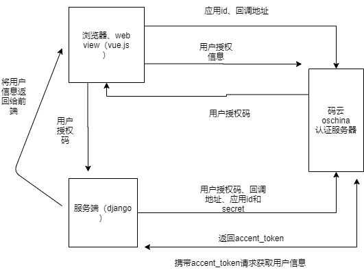

#  第三方登录

## Gitee

### 接入Gitee

登录Gitee后点击头像点击 **设置** -> **第三方应用**，创建要接入码云的应用，填写基本的信息


创建应用后会有**Client ID**和**Client Secret**，Client ID是Gitee为每个请求授权的个人或企业提供的唯一ID标识，



### 参考

[实现Gitee登录](https://blog.csdn.net/qq_41647780/article/details/119616662)

通过GET请求这个地址去获取授权码，{client_id}、{redirect_uri} 填写自己的应用id和回调地址

```
https://gitee.com/oauth/authorize?client_id={client_id}&redirect_uri={redirect_uri}&response_type=code
```

```html
<!DOCTYPE html>
<html lang="en" xmlns:th="http://www.thymeleaf.org">
<head>
    <meta charset="UTF-8">
    <title>index</title>
</head>
<body>
<a href="https://gitee.com/oauth/authorize?client_id={client_id}&redirect_uri={redirect_uri}&response_type=code&state=1">gitee登录</a>
<div>
    <p th:text="${name}"></p>
</div>
<div>
    <p th:text="${user.id}"></p>
</div>
</body>
</html>

```


浏览器输入：localhost 或 http://127.0.0.1/ ，点击gitee登录


gitee登录、可以页面看到获取到的用户信息


## qq


