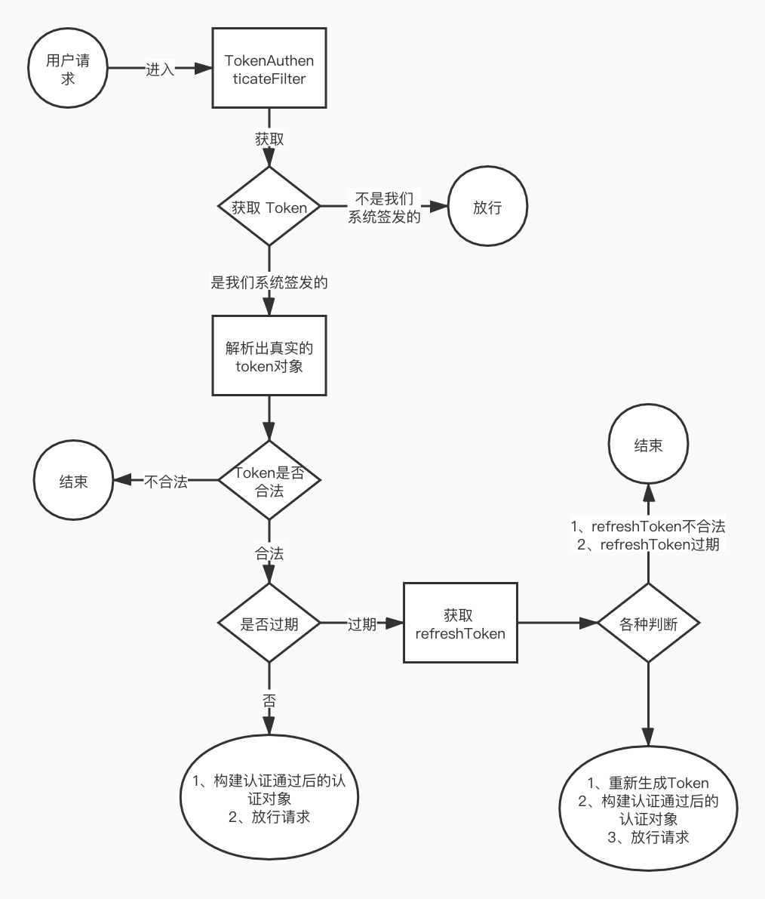

# Spring Security 

### 介绍
Spring Security 权限相关的内容

`写的有问题，推荐 在 token 快过期时，主动使用 refreshToken 去刷新token,而不要每次请求都发送 token 和 refreshToken,这样可能会造成 refreshToken 的泄漏。`

### 功能介绍  

```
spring-security-jwt 
    |- 实现 token 认证和 自动刷新 token  
    |- /jwt/getToken?userId=xxx 生成 token和refreshToken 在响应头中
    |- 后续请求需要在请求头中带上 token 和 refreshToken ,请求头字段由 application.yml 中定义  
  multi-security-filter-chain [博客](h
    |- 实现多Spring Security SecurityFilterChain
    |- 不同的 SecurityFilterChain 过滤器链使用 Order 注解来定义执行的顺序
    |- 不同的 SecurityFilterChain 处理不同的api，即不同的请求由不同的过滤器链进行处理
    |- 实现模拟的 app 和 网站 的不同的api的处理。
    |- DelegatingFilterProxy 中查看是如何决定使用那个 SecurityFilterChain 的。 
```

spring-security-jwt 


