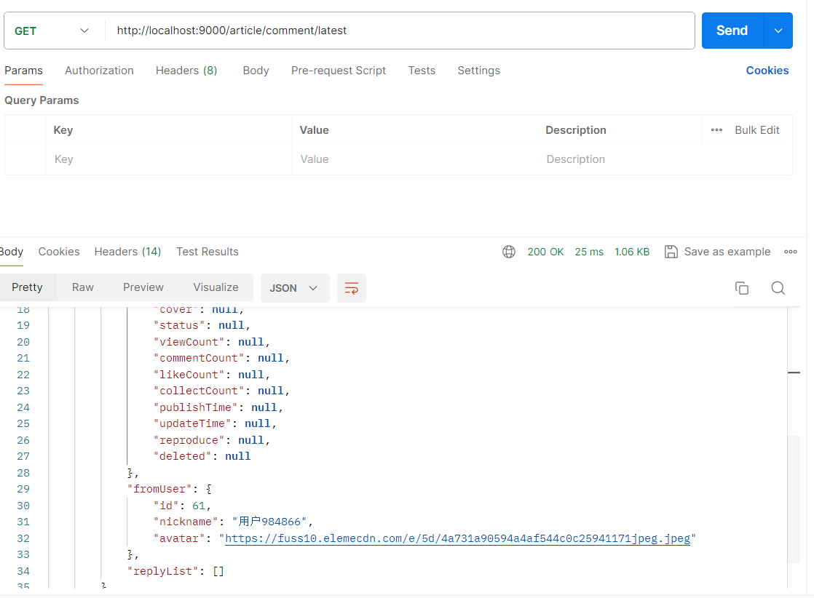

# 分析

## 客户端

系统用户认证区分客户端

+ pc网页端
+ 安卓客户端
+ ios客户端

各客户端可自定义设置是否支持refresh_token，自定义设置登录超时时间等

### 数据库客户端表设计

|        字段名        |                描述                |
| :------------------: | :--------------------------------: |
|          id          |                 id                 |
|      client_id       |              客户端id              |
|    client_secret     |             客户端秘钥             |
| access_token_expire  |        access_token有效时长        |
| refresh_token_expire |    refresh_token_expire有效时长    |
| enable_refresh_token | 是否启用 refresh_token，1:是，0:否 |

```sql
DROP TABLE IF EXISTS `client`;
CREATE TABLE `client` (
  `id` int(11) NOT NULL AUTO_INCREMENT COMMENT 'id',
  `client_id` varchar(50) NOT NULL COMMENT '客户端id，客户端唯一标识',
  `client_secret` varchar(255) NOT NULL COMMENT '客户端密码',
  `access_token_expire` bigint(20) DEFAULT NULL COMMENT 'access_token有效时长',
  `refresh_token_expire` bigint(20) DEFAULT NULL COMMENT 'refresh_token_expire有效时长',
  `enable_refresh_token` tinyint(1) NOT NULL DEFAULT '1' COMMENT '是否支持刷新refresh_token,1:是，0:否',
  PRIMARY KEY (`id`),
  UNIQUE KEY `index_client_id` (`client_id`) USING BTREE
) ENGINE=InnoDB AUTO_INCREMENT=6 DEFAULT CHARSET=utf8mb4 COMMENT='客户端表';

```

### 保存客户端

#### API 接口

请求方法：POST

请求地址：/client/save

请求数据格式：application/json

需要access_token： 是

需要管理员权限： 是

**请求体数据格式：**

```json
{
    "id": "id",
    "clientId": "客户端id, 唯一",
    "clientSecret": "客户端秘钥",
    "accessTokenExpire": "access_Token有效时间(s)",
    "refreshTokenExpire": "refresh_token有效时间(s)",
    "enableRefreshToken": "是否启用refresh_token,1:是，0:否"
}
```

接口说明：

+ id为null则新增，id不为null则更新
+ **超时时间单位为秒(小时: 60L * 60 * n,   天: 24 * 60L * 60 * n )** 默认为
+ 客户端id和客户端秘钥不能为空

**保存成功：**

```json
{
    "code": 200000,
    "message": "响应成功"
}
```

#### Postman

```
POST http://localhost:9000/client/save
```

**携带access_token**


**id为不null时更新**


保存到数据库中


**id为null时新增**


### 删除客户端

#### API 接口

请求方法：DELETE

请求地址：/client/delete/{id}

需要access_token： 是

需要管理员权限： 是

接口说明：物理删除。

**删除成功：**

```json
{
    "code": 200000,
    "message": "响应成功"
}
```

#### Postman

```
DELETE http://localhost:9000/client/delete/1
```

**携带access_token**


**删除成功**


**删除失败**


### 分页获取客户端

#### API 接口

请求方法：GET

请求地址：/client/page

请求参数：
current：当前页，非必传，默认1
size：每页数量，非必传，默认5

需要access_token： 是

需要管理员权限： 是

**获取成功：**

```json
{
    "code": 200000,
    "data": {
        "records": [
            {
                "id": 1,
                "clientId": "1",
                "clientSecret": "客户端秘钥",
                "accessTokenExpire": 7,
                "refreshTokenExpire": 15,
                "enableRefreshToken": 1
            }
        ],
        "total": 2,
        "size": 1,
        "current": 1,
        "orders": [],
        "optimizeCountSql": true,
        "searchCount": true,
        "maxLimit": null,
        "countId": null,
        "pages": 2
    },
    "message": "响应成功"
}
```

#### Postman

```
GET http://localhost:9000/client/page?current=1&size=1
```

**携带access_token**


**需要管理员权限： 是**


**需要管理员权限： 否**


## 短信发送

具体代码见:  


### API 接口

请求方法：POST

请求地址：/sms/send

请求参数：mobile：手机号，必传

需要access_token： 否

需要管理员权限： 否

接口说明：默认情况下，验证码5分钟内有效，同一手机号每天只能发10次；同一ip每天只能发10次；同一手机号限流120s一次。

> Tip
>
> 可以手动设置验证码到redis中，类型为Strig，key为sms:code:15649xxx56，值设置你想设置的验证码。 接口限流基于redis实现，key前缀为limit:sms:，删除redis对应的缓存即可去掉本次限流。

**响应成功：**

```json
{  
    "code": 0,  
    "message": "成功"
}
```

后端

```JAVA
@Log4j2
@RestController
@RequestMapping("/sms")
@Api(tags = "短信验证码服务",value = "/sms")
public class SmsController extends BaseController{

    @Autowired
    private SmsCodeService smsCodeService;

    @Autowired
    private EmailService emailService;

    @PostMapping("/send")
    @RateLimiter(name = RedisConstant.SMS_LIMIT_NAME,max = 1,key = "#mobile", timeout = 120L, extra = "smsLimiter")
    @ApiOperation(value = "发送短信验证码",notes = "验证码有效时5分钟;同一手机号每天只能发10次;同一ip每天只能发10次;同一手机号限流120s一次")
    public ApiResponse sendSmsCode(@ApiParam("手机号") @NotNull @IsPhone @RequestParam long mobile) {
        smsCodeService.sendSmsCode(mobile);
        return createResponse();
    }
}
```

前端

```js
/**
 * 发送验证码
 * @param {Object} params
 */
export function sendCode(params) {
  return request({
    url: '/sms/send',
    method: 'post',
    params: params
  })
}
```

### Postman

```
POST http://localhost:9000/sms/send
```


## 认证

### 认证区分客户端

登录、退出、刷新access_token接口都需要在请求头带上客户端信息。它决定了用户token过期时间

例子： `Authorization: Basic cGM6MTIzNDU2`

这里的`cGM6MTIzNDU2`为pc:123456经过base64加密后的密文。pc为clientId，123456为clientSecret。


### 账号密码登录

#### API 接口

请求方法：POST

请求地址：/account/login

请求参数：
username：用户名/手机号，必传
password：密码，必传

需要access_token： 否

需要管理员权限： 否

需要客户端认证： 是

接口说明：账号可以是用户名，也可以是手机号。

**登录成功：**

```json
{
    "code": 200000,
    "data": {
        "access_token": "fdbb3720-1a1d-4b90-935b-4c6d46029d80",
        "token_type": "Bearer",
        "refresh_token": "62385ed4-b184-4bf5-be18-f8762fafd5a4"
    },
    "message": "响应成功"
}
```

#### Postman


**登录成Redis储存**


### 手机号验证码登录

#### API 接口

请求方法：POST

请求地址：/mobile/login

请求参数：
mobile：手机号，必传
code：验证码，必传

需要access_token： 否

需要管理员权限： 否

需要客户端认证： 是

接口说明：验证码调发送验证码接口获取。

**登录成功：**

```json
{
    "code": 200000,
    "data": {
        "access_token": "fdbb3720-1a1d-4b90-935b-4c6d46029d80",
        "token_type": "Bearer",
        "refresh_token": "62385ed4-b184-4bf5-be18-f8762fafd5a4"
    },
    "message": "响应成功"
}
```

#### Postman


### 第三方登录

#### API 接口

请求方法：POST

请求地址：/oauth

请求参数：
type：类型，必传，1:qq，2:github，3:gitee
code：认证code，必传

需要access_token： 否

需要管理员权限： 否

需要[客户端认证](https://copoile.github.io/api/auth/)： 是

**接口说明：这里的code是第三方登录回调获取到的code。**

**登录成功：**

```json
{
  "code": 0,
  "message": "成功",
  "data": {
    "access_token": "6a2dc65f-74f6-4eb6-b4d2-2eba2af4f587",
    "token_type": "Bearer",
    "refresh_token": "17456dd5-5dbd-41ec-ad4f-7cf101c9ab3e"
  }
}
```

#### Postman

gitee

第三方回调


第三方登录接口


### 刷新access_token

请求方法：POST

请求地址：/refresh_access_token

请求参数：refresh_token：refresh_token，必传

需要access_token： 否

需要管理员权限： 否

需要[客户端认证](https://copoile.github.io/api/auth/)： 是

接口说明：需要客户的启用refresh_token；access_token过期时间一般比refresh_token短，使用refresh_token刷新access_token可避免频繁登录。

**刷新成功：**

```json
{
  "code": 200000,
  "message": "成功",
  "data": {
   "access_token": "6a2dc65f-74f6-4eb6-b4d2-2eba2af4f587",
   "token_type": "Bearer",
   "refresh_token": "17456dd5-5dbd-41ec-ad4f-7cf101c9ab3e"
  }
}
```

### 退出

请求方法：DELETE

请求地址：/logout

请求参数：access_token：access_token，必传

需要access_token： 否

需要管理员权限： 否

需要[客户端认证](https://copoile.github.io/api/auth/)： 是

接口说明：**这里的access_token以参数形式传递而非请求头形式。**

**退出成功：**

```json
{
  "code": 200000,
  "message": "成功"
}
```

前端核心代码

```ts
/**
 * @description 退出
 * @param {Object} params
 */
export function logout(params) {
  return request(import.meta.env.VITE_APP_BASE_API + '/logout', {
    headers: {
      'Authorization': 'Basic cGM6MTIzNDU2'
    },
    method: 'delete',
    params: params
  })
}
```

```ts
    /**
     * 退出
     */
    async logout() {
      try {
        const access_token = this.token;
        this.resetToken();
        const params = {
          access_token: access_token,
        };
        await logout(params);
        return Promise.resolve();
      } catch (error) {
        throw error;
      }
    },
```


## 用户

系统用户

+ 系统管理员:   拥有全部权限
+ 普通用户:  拥有评论、留言等权限

### 数据库用户表设计

|   字段名    |                   描述                   |
| :---------: | :--------------------------------------: |
|     id      |                    id                    |
|  username   |                  用户名                  |
|  password   |                   密码                   |
|   mobile    |                  手机号                  |
|  nickname   |                   昵称                   |
|   gender    |           性别，1：男 ，0：女            |
|  birthday   |                   生日                   |
|    email    |                   邮箱                   |
|    brief    |                 个性签名                 |
|   avatar    |                   头像                   |
|   status    | 状态，0：正常，1：锁定，2：禁用，3：过期 |
|    admin    |         是否管理员，1：是，0：否         |
| create_time |                 注册时间                 |

### 用户注册

#### API 接口

请求方法：POST

请求地址：/user/register

请求数据格式：application/json

需要access_token： 否

需要管理员权限： 否

请求体json：

```json
{
  "code": "验证码",
  "mobile": "手机号",
  "password": "密码",
  "username": "用户名"
}
```

接口说明：

+ 验证码调发送验证码接口获取；
+ 用户名只能字母开头，允许2-16字节，允许字母数字下划线；密码不能少于6位数。
+ 默认创建普通用户

注册成功：

```json
{  
    "code": 200000,  
    "message": "成功"
}
```

#### Postman

```
POST http://localhost:9000/user/register
```

1、发起短信


2、用户注册


3、查看数据库


### 获取用户信息

#### API 接口

请求方法：GET

请求地址：/user/info

需要access_token： 是

需要管理员权限： 否

接口说明：前端权限菜单可根据roles生成；用户头像可能不存在，默认头像前端指定即可。

**获取成功：**

```json
{
    "code": 200000,
    "data": {
        "id": 61,
        "username": "lfj",
        "password": "$2a$10$v6cYGcfvupH5CRsH7torC.hT1OgGZng/vAUqGLdbLwOjLCrDWbB8m",
        "mobile": 15775984866,
        "nickname": "用户984866",
        "gender": 1,
        "birthday": "2024-04-01",
        "email": "1665843268@qq.com",
        "avatar": "https://fuss10.elemecdn.com/e/5d/4a731a90594a4af544c0c25941171jpeg.jpeg",
        "status": 0,
        "admin": 0,
        "createTime": "2024-04-01 19:13:46",
        "roles": [
            "ordinary"
        ]
    },
    "message": "响应成功"
}
```

#### Postman

```
GET http://localhost:9000/user/info
```


### 邮箱

绑定邮箱时:

1. 需验证邮箱，调用成功会发送验证链接到邮箱中，链接中携带的参数code将作为绑定邮箱的凭证。
2. code为邮箱验证接口发送的验证链接的参数code，前端拿到code进行邮箱绑定(其中这里就是点击向后端发起绑定邮箱请求)。
3. 

#### 邮箱验证

##### API接口

请求方法：POST

请求地址：/user/email/validate

请求参数：email：邮箱

需要access_token： 是

需要管理员权限： 否

接口说明：绑定邮箱时需验证邮箱，调用成功会发送验证链接到邮箱中，链接中携带的参数code将作为绑定邮箱的凭证。

**发送成功：**

```json
{
    "code": 200000,
    "message": "响应成功"
}
```

##### Postman


#### 邮箱绑定

##### API 接口

请求方法：POST

请求地址：/user/email/bind

请求参数：code：code

需要access_token： 否

需要管理员权限： 否

接口说明：code为邮箱验证接口发送的验证链接的参数code，前端拿到code进行邮箱绑定(其中这里就是点击向后端发起绑定邮箱请求)。

**绑定成功：**

```json
{
    "code": 200000,
    "message": "响应成功"
}
```

##### Postman


### 重置密码

#### API 接口

请求方法：POST

请求地址：/user/password/reset

请求参数：
mobile：手机号，必传
code：验证码，必传
password：密码，必传

需要access_token： 否

需要管理员权限： 否

接口说明：验证码调发送验证码接口获取；密码不能少于6位数。

**重置成功：**

```json
{
  "code": 200000,
  "message": "成功"
}
```

#### Postman


### 下述 TODO

### 修改密码

#### API接口

请求方法：POST

请求地址：/user/password/update

请求参数：
oldPassword：原密码，必传
newPassword：新密码，必传

需要access_token： 是

需要管理员权限： 否

接口说明：密码不能少于6位数。

**修改成功：**

```json
{
  "code": 200000,
  "message": "成功"
}
```

#### Postman


### 更换头像

请求方法：POST

请求地址：/user/avatar/update

请求数据格式：multipart/form-data

请求参数：file：头像文件，必传

需要access_token： 是

需要管理员权限： 否

接口说明：文件大小不能超过5MB，文件格式只限bmp、gif、jpeg、jpeg、png、webp格式。

**更新成功：**

```json
{
  "code": 200000,
  "message": "成功"
}
```

### 更新用户信息

请求方法：POST

请求地址：/user/update

请求数据格式：application/json

需要access_token： 是

需要管理员权限： 否

请求体json：

```json
{
  "birthday": "生日",
  "brief": "简介",
  "gender": "性别，1：男，0：女",
  "nickname": "昵称",
  "userId": "当前用户id"
}
```

接口说明： 生日日期格式为yyyy-mm-dd；当前用户id不可空；更新不为null的项。

**更新成功：**

```json
{  
    "code": 0,  
    "message": "成功"
}
```

### 手机号

#### 验证原手机号

请求方法：POST

请求地址：/user/mobile/validate

请求参数：
mobile：原手机号，必传
code：验证码，必传

需要access_token： 是

需要管理员权限： 否

接口说明：更换手机号需要验证原手机号，验证码调发送验证码接口获取。

**验证成功：**

```json
{
  "code": 0,
  "message": "成功"
}
```

#### 更换手机号

请求方法：POST

请求地址：/user/mobile/rebind

请求参数：
mobile：新手机号，必传
code：验证码，必传

需要access_token： 是

需要管理员权限： 否

接口说明：绑定新手机号需经过验证验证原手机号步骤，且距离上一步验证时间不超过5分钟；验证码调发送验证码接口获取。

**绑定成功：**

```json
{
  "code": 0,
  "message": "成功"
}
```

### 第三方登录用户

#### 绑定手机号

请求方法：POST

请求地址：/user/mobile/bind

请求参数：
mobile：手机号，必传
code：验证码，必传

需要access_token： 是

需要管理员权限： 否

接口说明：该接口只用于原手机号为空时（第三方登录）绑定手机号；验证码调发送验证码接口获取。

绑定成功：

```json
{
  "code": 0,
  "message": "成功"
}
```

#### 绑定用户名

请求方法：POST

请求地址：/user/username/bind

请求参数：
username：用户名，必传

需要access_token： 是

需要管理员权限： 否

接口说明：该接口只用于原用户名为空时（第三方登录）绑定用户名。

绑定成功：

```json
{
  "code": 0,
  "message": "成功"
}
```

### 管理员用户

#### 分页获取用户

请求方法：GET

请求地址：/user/page

请求参数：
current：当前页，默认1
size：每页数量，默认5
username：用户名关键字，非必传
nickname：昵称关键字，非必传

需要access_token： 是

需要管理员权限： 是

接口说明：用于后台管理，支持用户名和昵称模糊查询。

查询成功：

```json
{
  "code": 0,
  "message": "成功",
  "data": {
    "records": [
      {
        "id": 1,
        "username": "admin",
        "mobile": 15625295093,
        "nickname": "小管家",
        "gender": 0,
        "birthday": "2019-07-08",
        "email": "15625295093@163.com",
        "brief": "简23介",
        "avatar": "https://poile-img.nos-eastchina1.126.net/me.png",
        "status": 0,
        "createTime": "2019-10-23T16:29:49",
        "admin": 1
      }
    ],
    "total": 1,
    "size": 5,
    "current": 1,
    "searchCount": true,
    "pages": 1
  }
}
```

#### 用户状态修改

请求方法：POST

请求地址：/user/status/update

请求参数：
userId：用户id，必传
status：状态，必传，0:正常，1:锁定，2:禁用，3:过期    (这里使用Spring Security )

需要access_token： 是

需要管理员权限： 是

接口说明：用于禁用、锁定用户等操作。

修改成功：

```json
{
  "code": 0,
  "message": "成功"
}
```

## 友链

支持博客友链。用于前端显示。

### 数据库友链表设计

| 字段名 | 描述 |
| :----: | :--: |
|   id   |  id  |
|  name  | 名称 |
|  url   | 链接 |
|  icon  | 图标 |

### 保存友链

请求方法：POST

请求地址：/friend/link/save

请求数据格式：application/json

需要access_token： 是

需要管理员权限： 是

请求体数据格式：

```json
{
  "icon": "图标",
  "id": "id",
  "name": "名称",
  "url": "链接"
}
```

接口说明：id为null则新增，id不为null则更新;name和url不能为空；

保存成功：

```json
{  
    "code": 200000,  
    "message": "成功"
}
```

### 删除友链

请求方法：DELETE

请求地址：/friend/link/delete/{id}

需要access_token： 是

需要管理员权限： 是

接口说明：物理删除。

删除成功：

```json
{  
    "code": 200000,  
    "message": "成功"
}
```

### 获取友链列表

请求方法：GET

请求地址：/friend/link/list

需要access_token： 否

需要管理员权限： 否

获取成功：

```json
{
  "code": 200000,
  "message": "成功",
  "data": [
    {
      "id": 1,
      "name": "xx博客",
      "url": "https://xxxx"
    }
  ]
}
```


### 分页获取友链

请求方法：GET

请求地址：/friend/link/page

请求参数：
current：当前页，非必传，默认1
size：每页数量，非必传，默认5

需要access_token： 否

需要管理员权限： 否

获取成功：

```json
{
  "code": 200000,
  "message": "成功",
  "data": {
    "records": [
      {
        "id": 1,
        "name": "xx博客",
        "url": "https://xxxx",
        "icon": "https://icon"
      }
    ],
    "total": 1,
    "size": 5,
    "current": 1,
    "searchCount": true,
    "pages": 1
  }
}
```


## 标签

标签用于给文章贴标签，文章与标签为多对多的关系，两者之间的关系通过桥表关联。只有获取标签不需要管理权限

### 数据库标签表设计

| 字段名  |          描述          |
| :-----: | :--------------------: |
|   id    |           id           |
|  name   |         标签名         |
| deleted | 是否删除，1：是，0：否 |

### 数据库文章标签关联表设计

|   字段名   |  描述  |
| :--------: | :----: |
|     id     |   id   |
| article_id | 文章id |
|   tag_id   | 标签id |

### 新增标签

请求方法：POST

请求地址：/tag/add

请求参数：tagName ：标签名，必传

需要access_token： 是

需要管理员权限： 是

接口说明：新增标签。

添加成功：

```json
{  
    "code": 200000,  
    "message": "成功"
}
```

### 分页获取标签

请求方法：GET

请求地址：/tag/page

请求参数：
current：当前页，非必传，默认1
size：每页数量，非必传，默认5
tagName：标签名，非必传

需要access_token： 是

需要管理员权限： 是

接口说明：支持标签名模糊查询。

获取成功:

```json
{
  "code": 0,
  "message": "成功",
  "data": {
    "records": [
      {
        "id": 1,
        "name": "测试标签1"
      },
      {
        "id": 2,
        "name": "测试标签2"
      }
    ],
    "total": 2,
    "size": 5,
    "current": 1,
    "searchCount": true,
    "pages": 1
  }
}
```

### 获取标签列表

请求方法：GET

请求地址：/tag/list

请求参数：tagName：标签名，非必传

需要access_token： 否

需要管理员权限： 否

接口说明：支持标签名模糊查询。

**获取成功:**

```json
{
    "code": 200000,
    "data": [
        {
            "id": 1,
            "name": "c++",
            "deleted": 0
        },
        {
            "id": 2,
            "name": "测试",
            "deleted": 0
        },
        {
            "id": 3,
            "name": "java",
            "deleted": 0
        }
    ],
    "message": "响应成功"
}
```


### 修改标签

请求方法：POST

请求地址：/tag/update

请求参数：
id：标签id，必传
name：标签名，必传

需要access_token： 是

需要管理员权限： 是

接口说明：标签修改只可修改标签名。

修改成功:

```json
{
  "code": 0,
  "message": "成功"
}
```

### 删除标签

请求方法：DELETE

请求地址：/tag/delete/{id}

需要access_token： 是

需要管理员权限： 是

接口说明：逻辑删除。

删除成功:

```json
{
  "code": 0,
  "message": "成功"
}
```


## 文件存储

文件存储主要用于存储文章封面，文章内容富文本中的图片等。

### 上传文件

请求方法：POST

请求地址：/file/upload

**请求数据格式：multipart/form-data  (默认表单)**

请求参数：file：文件，必传

需要access_token： 是

需要管理员权限： 是

**接口说明：文件大小不能超过5MB，上传成功后返回文件url。**

上传成功：

```json
{
    "code": 200000,
    "data": "http://resource.poile.cn/1712300280293.png",
    "message": "响应成功"
}
```

使用本地存储


### 删除文件

请求方法：DELETE

请求地址：/file/delete

**请求参数：fullPath ：文件url**

需要access_token： 是

需要管理员权限： 是

接口说明：删除已上传的文件

删除成功:

```json
{
  "code": 0,
  "message": "成功"
}
```


### 读取-本地储存

请求方法：GET

请求地址：文件url

需要access_token： 否

需要管理员权限： 否

接口说明：删除已上传的文件


### 分页获取  TODO

## 分类

<span style="color:red">字段parent_id用于生成树形结构的分类，分类需要树形结构，parent_id默认都传0即可。</span>

### 数据库分类表设计

|  字段名   |          描述          |
| :-------: | :--------------------: |
|    id     |           id           |
|   name    |         分类名         |
| parent_id |          父id          |
|  deleted  | 是否删除，1：是，0：否 |

### 新增分类

请求方法：POST

请求地址：/category/add

请求数据格式：application/json

需要access_token： 是

需要管理员权限： 是

请求体json：

```json
{
  "name": "分类名",
  "parentId": "父id"
}
```

接口说明：一级分类parentId传0，若分类不需区分上下级parentId都传0即可。

新增成功：

```json
{
    "code": 200000,
    "message": "响应成功"
}
```


### 获取分类树

#### API接口

请求方法：GET

请求地址：/category/tree

需要access_token： 是

需要管理员权限： 是

接口说明：获取到的数据其数据类型为树形结构。

获取成功:

```json
{
    "code": 200000,
    "data": [
        {
            "id": "1",
            "text": "小说",
            "checked": false,
            "children": [
                {
                    "id": "12",
                    "text": "一级分类一",
                    "checked": false,
                    "children": [],
                    "parentId": "1",
                    "hasParent": true,
                    "hasChildren": false
                }
            ],
            "parentId": "0",
            "hasParent": false,
            "hasChildren": true
        },
        {
            "id": "13",
            "text": "一级分类二",
            "checked": false,
            "children": [],
            "parentId": "0",
            "hasParent": false,
            "hasChildren": false
        }
    ],
    "message": "响应成功"
}
```

**返回前端数据 treeVo**

使用@JsonInclude(JsonInclude.Include.NON_NULL)只返回不为空数据

```java
package com.lfj.blog.utils.buildTreeUtil;

import com.fasterxml.jackson.annotation.JsonInclude;

import java.util.ArrayList;
import java.util.List;
import java.util.Map;

/**
 * @Author: LFJ
 * @Date: 2024-04-06 16:19
 */

@JsonInclude(JsonInclude.Include.NON_NULL)
public class TreeVo<T> {
	/**
	 * 节点ID
	 */
	private String id;
	/**
	 * 显示节点文本
	 */
	private String text;
	/**
	 * 节点状态，open closed
	 */
	private Map<String, Object> state;
	/**
	 * 节点是否被选中 true false
	 */
	private boolean checked = false;
	/**
	 * 节点属性
	 */
	private Map<String, Object> attributes;

	/**
	 * 节点的子节点 List<TreeVo<T>>
	 */
	private List<TreeVo<T>> children = new ArrayList<TreeVo<T>>();

	/**
	 * 父ID
	 */
	private String parentId;
	/**
	 * 是否有父节点
	 */
	private boolean hasParent = false;
	/**
	 * 是否有子节点
	 */
	private boolean hasChildren = false;

	public TreeVo(String id, String text, Map<String, Object> state, boolean checked, Map<String, Object> attributes,
				  List<TreeVo<T>> children, boolean isParent, boolean isChildren, String parentID) {
		super();
		this.id = id;
		this.text = text;
		this.state = state;
		this.checked = checked;
		this.attributes = attributes;
		this.children = children;
		this.hasParent = isParent;
		this.hasChildren = isChildren;
		this.parentId = parentID;
	}

	public TreeVo() {
		super();
	}

	public String getId() {
		return id;
	}

	public void setId(String id) {
		this.id = id;
	}

	public String getText() {
		return text;
	}

	public void setText(String text) {
		this.text = text;
	}

	public Map<String, Object> getState() {
		return state;
	}

	public void setState(Map<String, Object> state) {
		this.state = state;
	}

	public boolean isChecked() {
		return checked;
	}

	public void setChecked(boolean checked) {
		this.checked = checked;
	}

	public Map<String, Object> getAttributes() {
		return attributes;
	}

	public void setAttributes(Map<String, Object> attributes) {
		this.attributes = attributes;
	}

	public List<TreeVo<T>> getChildren() {
		return children;
	}

	public void setChildren(List<TreeVo<T>> children) {
		this.children = children;
	}

	public void setChildren(boolean isChildren) {
		this.hasChildren = isChildren;
	}

	public boolean isHasParent() {
		return hasParent;
	}

	public void setHasParent(boolean isParent) {
		this.hasParent = isParent;
	}

	public boolean isHasChildren() {
		return hasChildren;
	}

	public String getParentId() {
		return parentId;
	}

	public void setParentId(String parentId) {
		this.parentId = parentId;
	}

	@Override
	public String toString() {
		return "TreeVo [id=" + id + ", text=" + text + ", state=" + state + ", checked=" + checked + ", attributes="
				+ attributes + ", children=" + children + ", parentId=" + parentId + ", hasParent=" + hasParent
				+ ", hasChildren=" + hasChildren + "]";
	}

}
```

#### Postman


### 分页列表

#### 获取分类列表

请求方法：GET

请求地址：/category/list

需要access_token： 否

需要管理员权限： 否

接口说明：获取分类列表,  每个用户都可查看

获取成功:

```json
{
    "code": 200000,
    "data": [
        {
            "id": 1,
            "name": "小说",
            "parentId": 0,
            "deleted": 0
        },
        {
            "id": 12,
            "name": "一级分类一",
            "parentId": 1,
            "deleted": 0
        },
        {
            "id": 13,
            "name": "一级分类二",
            "parentId": 0,
            "deleted": 0
        }
    ],
    "message": "响应成功"
}
```


#### 分页获取分类列表(管理员)

请求方法：GET

请求地址：/category/page

请求参数：
current：当前页，非必传，默认1
size：每页数量，非必传，默认5

需要access_token： 是

需要管理员权限： 是

接口说明：分页获取分类

获取成功:

```json
{
    "code": 200000,
    "data": {
        "records": [
            {
                "id": 1,
                "name": "小说",
                "parentId": 0,
                "deleted": 0
            }
        ],
        "total": 3,
        "size": 1,
        "current": 1,
        "orders": [],
        "optimizeCountSql": true,
        "searchCount": true,
        "maxLimit": null,
        "countId": null,
        "pages": 3
    },
    "message": "响应成功"
}
```


### 修改分类

请求方法：POST

请求地址：/category/update

请求参数：
id：分类id，必传
name：分类名，必传

需要access_token： 是

需要管理员权限： 是

接口说明：分类修改只可修改分类名

修改成功:

```json
{
  "code": 200000,
  "message": "成功"
}
```

### 删除分类

请求方法：DELETE

请求地址：/category/delete/{id}

需要access_token： 是

需要管理员权限： 是

接口说明：逻辑删除,若存在子类，则不允许删除。

删除成功:

```json
{
  "code": 200000,
  "message": "成功"
}
```


## 文章

文章分原创和转载，文章为转载时需标出文章转载地址。

### 文章数据库表设计

|    字段名     |                  描述                   |
| :-----------: | :-------------------------------------: |
|      id       |                   id                    |
|   original    |          是否原创，1:是，0:否           |
|    user_id    |                 用户id                  |
|  category_id  |                 分类id                  |
| category_name |            分类名称-冗余字段            |
|     title     |                文章标题                 |
|    summary    |                文章摘要                 |
|    content    |                文章内容                 |
| hmtl_content  |             文章富文本内容              |
|    status     | 文章状态：0为正常，1为待发布，2为回收站 |
|  view_count   |              文章浏览次数               |
| comment_count |             评论数-冗余字段             |
|  like_count   |             点赞数-冗余字段             |
| collect_count |             收藏数-冗余字段             |
| publish_time  |                发布时间                 |
|  update_time  |                更新时间                 |
|   reproduce   |                转载地址                 |
|    deleted    |           已删除，1：是，0否            |

### 保存文章

接口说明：

+ **`文章id为null时为新增，不为null时为更新；`**
+ **`文章标签最多4个；`**
+ **`文章为转载时，需标出转载地址；`**
+ **`接口将文章状态置为待发布状态;`**
+ **`保存成功返回文章id；`**
+ `content` 原始文本内容
+ `htmlContent` 编辑器将 `content` 渲染为 HTML 后的结果

请求方法：POST

请求地址：/article/save

请求数据格式：application/json

需要access_token： 是

需要管理员权限： 是

请求体数据格式：

```json
{
  "categoryId": "分类id",
  "content": "文章内容",
  "cover": "封面",
  "id": "文章id",
  "original": "是否原则，1:是，0:否",
  "reproduce": "转载地址",
  "summary": "文章摘要",
  "tagIds": [
    "标签id数组"
  ],
  "title": "文章标题"
}
```

接口说明：文章id为null时为新增，不为null时为更新；文章标签最多4个；文章为转载时，需标出转载地址；接口将文章状态置为待发布状态;保存成功返回文章id；

保存成功：

```json
{
    "code": 200000,
    "data": 1,
    "message": "响应成功"
}
```


### 分页获取文章（前台）

#### API接口

接口说明：

+ 用于前端文章列表显示

  

+ **`只可获取到已发布的文章；`**

+ **`可用于文章标题模糊搜索；`**
+ **`可用于文章归档年月、分类、标签查询对应文章列表；`**
+ **`可用于点击排行列表；可用于最新文章列表`**

请求方法：GET

请求地址：/article/published/page

请求参数：
current：当前页，非必传，默认1
size：每页数量，非必传，默认5
categoryId：分类id，非必传
tagId：标签id，非必传
yearMonth：年月, 格式yyyy-mm，非必传(获取整个月份)
orderBy：排序字段，倒序，非必传，默认:publish_time;  可选项：发布时间:publish_time、浏览数:view_count
title：标题关键字，非必传

需要access_token： 否

需要管理员权限： 否

获取成功：

```json
{
  "code": 0,
  "message": "成功",
  "data": {
    "records": [
      {
        "id": 1,
        "original": 1,
        "categoryName": "一级分类一",
        "categoryId": 1,
        "title": "标题",
        "summary": "摘要",
        "cover": "http:www.baidu.com",
        "status": 1,
        "viewCount": 0,
        "commentCount": 0,
        "likeCount": 0,
        "collectCount": 0,
        "publishTime": "2019-12-31 17:53:49",
        "updateTime": "2019-12-31 17:53:49",
        "user": {
          "id": 1,
          "nickname": "小管家",
          "avatar": "https://poile-img.nos-eastchina1.126.net/me.png"
        },
        "tagList": [
          {
            "id": 1,
            "name": "测试"
          }
        ]
      }
    ],
    "total": 1,
    "size": 5,
    "current": 1,
    "searchCount": true,
    "pages": 1
  }
}
```

返回前端的数据是ArticleVo封装(Article实体数据部分数据  + User部分数据 + tag部分数据)


#### Postman


### 文章详情(浏览文章)（前台）

请求方法：GET

请求地址：/article/view/{id}

需要access_token： 否

需要管理员权限： 否

**接口说明：用于前台查看详情时调用；返回文章内容htmlContent；返回上一篇和下一篇。**

获取成功：

```json
{
  "code": 0,
  "message": "成功",
  "data": {
    "id": 2,
    "original": 1,
    "categoryName": "一级分类二",
    "categoryId": 2,
    "title": "string",
    "summary": "string",
    "htmlContent": "string",
    "cover": "string",
    "status": 0,
    "viewCount": 0,
    "commentCount": 0,
    "likeCount": 0,
    "collectCount": 0,
    "publishTime": "2020-01-02 20:24:16",
    "updateTime": "2020-01-02 20:24:16",
    "user": {
      "id": 1,
      "nickname": "小管家",
      "avatar": "https://poile-img.nos-eastchina1.126.net/me.png"
    },
    "tagList": [
      {
        "id": 1,
        "name": "测试"
      }
    ],
    "previous": {
      "id": 1,
      "title": "标题"
    },
    "next": {
      "id": 3,
      "title": "string2"
    }
  }
}
```


### 分页获取文章（后台）

请求方法：GET

请求地址：/article/page

请求参数：
current：当前页，非必传，默认1
size：每页数量，非必传，默认5
status：文章状态,非必传，不传查全部；0:已发布，1:未发布，2:回收站
categoryId：分类id，非必传
tagId：标签id，非必传
yearMonth：年月,格式yyyy-mm，非必传
title：标题关键字，非必传

需要access_token： 是

需要管理员权限： 是

接口说明：查询非已删除的文章，用于文章后台管理。

获取成功：

```json
{
  "code": 0,
  "message": "成功",
  "data": {
    "records": [
      {
        "id": 1,
        "original": 1,
        "categoryName": "一级分类一",
        "categoryId": 1,
        "title": "标题",
        "summary": "摘要",
        "cover": "http:www.baidu.com",
        "status": 1,
        "viewCount": 0,
        "commentCount": 0,
        "likeCount": 0,
        "collectCount": 0,
        "publishTime": "2019-12-31 17:53:49",
        "updateTime": "2019-12-31 17:53:49",
        "user": {
          "id": 1,
          "nickname": "小管家",
          "avatar": "https://poile-img.nos-eastchina1.126.net/me.png"
        },
        "tagList": [
          {
            "id": 1,
            "name": "测试"
          }
        ]
      }
    ],
    "total": 1,
    "size": 5,
    "current": 1,
    "searchCount": true,
    "pages": 1
  }
}
```

### 文章详情（后台）

请求方法：GET

请求地址：/article/detail/{id}

需要access_token： 是

需要管理员权限： 是

接口说明：**用于后台文章编辑或查看详情时调用；返回文章内容；返回分类列表，在启用分类区分子父类情况下，用于编辑时分类回显,数组顺序为[node3, node2, root]。**

获取成功：

```json
{
  "code": 0,
  "message": "成功",
  "data": {
    "id": 1,
    "original": 1,
    "categoryName": "一级分类一",
    "categoryId": 1,
    "title": "标题",
    "summary": "摘要",
    "content": "内容",
    "htmlContent": "内容",
    "cover": "http:www.baidu.com",
    "status": 1,
    "viewCount": 0,
    "commentCount": 0,
    "likeCount": 0,
    "collectCount": 0,
    "publishTime": "2019-12-31 17:53:49",
    "updateTime": "2019-12-31 17:53:49",
    "user": {
      "id": 1,
      "nickname": "小管家",
      "avatar": "https://poile-img.nos-eastchina1.126.net/me.png"
    },
    "tagList": [
      {
        "id": 1,
        "name": "测试"
      }
    ],
    "categoryList": [
      {
        "id": 1,
        "name": "一级分类一",
        "parentId": 0
      }
    ]
  }
}
```


### 文章浏览数自增

请求方法：PUT

请求地址：/increment_view/{id}

需要access_token： 否

需要管理员权限： 否

**接口说明：20分钟内ip或用户文章浏览计数，data返回true则表示此次成功自增**

调用成功：

```json
{  
    "code": 0,  
    "message": "成功",
    "data": true
}
```


客户端 -> 用户<注册> -> 认证(登录) -> 用户/文章/


### 相关文章

请求方法：GET

请求地址：/article/interrelated/list

请求参数：
articleId：文章id，必传
limit：列表数量，非必传，默认5

需要access_token： 否

需要管理员权限： 否

**接口说明：后台实际根据分类或标签查询。**

获取成功：

```json
{
  "code": 0,
  "message": "成功",
  "data": [
    {
      "id": 2,
      "original": 1,
      "categoryName": "一级分类二",
      "categoryId": 2,
      "title": "string",
      "summary": "string",
      "cover": "string",
      "status": 0,
      "viewCount": 1,
      "commentCount": 0,
      "likeCount": 0,
      "collectCount": 0,
      "publishTime": "2020-01-02 20:24:16",
      "updateTime": "2020-01-02 20:24:16",
      "user": {
        "id": 1,
        "nickname": "小管家",
        "avatar": "https://poile-img.nos-eastchina1.126.net/me.png"
      },
      "tagList": [
        {
          "id": 1,
          "name": "测试"
        }
      ]
    },
    {
      "id": 3,
      "original": 1,
      "categoryName": "一级分类二",
      "categoryId": 2,
      "title": "string2",
      "summary": "string2",
      "cover": "string2",
      "status": 0,
      "viewCount": 0,
      "commentCount": 0,
      "likeCount": 0,
      "collectCount": 0,
      "publishTime": "2020-01-02 20:24:36",
      "updateTime": "2020-01-02 20:24:36",
      "user": {
        "id": 1,
        "nickname": "小管家",
        "avatar": "https://poile-img.nos-eastchina1.126.net/me.png"
      },
      "tagList": [
        {
          "id": 1,
          "name": "测试"
        }
      ]
    }
  ]
}
```


### 丢弃文章

请求方法：DELETE

请求地址：/article/discard/{id}

需要access_token： 是

需要管理员权限： 是

接口说明：**文章状态将置为回收站状态。**

丢弃成功：

```json
{  
    "code": 0,  
    "message": "成功"
}
```

### 删除文章

请求方法：DELETE

请求地址：/article/delete/{id}

需要access_token： 是

需要管理员权限： 是

接口说明：**逻辑删除。**

删除成功：

```json
{  
    "code": 0,  
    "message": "成功"
}
```

### 修改文章状态

请求方法：POST

请求地址：/article/status/update

请求参数：
articleId：文章id，必传
status：文章状态，必传，值可选项，0:发布，1:待发布，2:回收站

需要access_token： 是

需要管理员权限： 是

接口说明：用于发布文章撤回，删除文章撤回等操作。

修改成功：

```json
{  
    "code": 0,  
    "message": "成功"
}
```

### 文章归档

请求方法：GET

请求地址：/article/archives/page

请求参数：
current：当前页，非必传，默认1
size：每页数量，非必传，默认12

需要access_token： 否

需要管理员权限： 否

接口说明：**按年月归档，月份文章计数。**

获取成功：

```json
{
  "code": 0,
  "message": "成功",
  "data": {
    "records": [
      {
        "yearMonth": "2020-01",
        "articleCount": 2
      },
      {
        "yearMonth": "2019-12",
        "articleCount": 1
      }
    ],
    "total": 2,
    "size": 12,
    "current": 1,
    "searchCount": true,
    "pages": 1
  }
}
```

### 标签文章统计

请求方法：GET

请求地址：/article/tag/statistic

需要access_token： 否

需要管理员权限： 否

接口说明：按标签计数文章数。


获取成功：

```json
{
  "code": 0,
  "message": "成功",
  "data": [
    {
      "id": 1,
      "name": "测试",
      "articleCount": 3
    }
  ]
}
```

### 分类文章统计

请求方法：GET

请求地址：/article/category/statistic

需要access_token： 否

需要管理员权限： 否

接口说明：按分类计数文章数。

获取成功：

```json
{
  "code": 0,
  "message": "成功",
  "data": [
    {
      "id": 1,
      "name": "一级分类一",
      "parentId": 0,
      "articleCount": 1
    },
    {
      "id": 2,
      "name": "一级分类二",
      "parentId": 0,
      "articleCount": 2
    },
    {
      "id": 3,
      "name": "二级分类一",
      "parentId": 1,
      "articleCount": 0
    },
    {
      "id": 4,
      "name": "彩色",
      "parentId": 0,
      "articleCount": 0
    }
  ]
}
```

## 文章推荐

文章推荐为手动推荐，可用于首页专栏【推荐阅读】或轮播之类的。

文章推荐基于redis的zset实现，数据直接存储在redis中，按分数顺序排序，及score可当作是排序字段。

### 保存到推荐

请求方法：POST

请求地址：/article/recommend/save

请求参数：
articleId：文章id，必传
score：分数，必传

需要access_token： 是

需要管理员权限： 是

**接口说明：只能添加已发布文章；若已添加则更新缓存；分数即为排序（顺序）。**

保存成功：

```json
{  
    "code": 0,  
    "message": "成功"
}
```


### 删除推荐

请求方法：DELETE

请求地址：/article/recommend/delete/{articleId}

需要access_token： 是

需要管理员权限： 是

接口说明：从推荐列表中删除。

删除成功：

```json
{  
    "code": 0,  
    "message": "成功"
}
```

### 获取推荐列表

请求方法：GET

请求地址：/article/recommend/list

需要access_token： 否

需要管理员权限： 否

接口说明：获取文章推荐列表。

获取成功：

```json
{
  "code": 0,
  "message": "成功",
  "data": [
    {
      "id": 1,
      "original": 1,
      "categoryName": "一级分类一",
      "categoryId": 1,
      "title": "标题",
      "summary": "摘要",
      "cover": "http:www.baidu.com",
      "status": 0,
      "viewCount": 1,
      "commentCount": 0,
      "likeCount": 0,
      "collectCount": 0,
      "publishTime": "2019-12-31 17:53:49",
      "updateTime": "2019-12-31 17:53:49",
      "user": {
        "id": 1,
        "nickname": "小管家",
        "avatar": "https://poile-img.nos-eastchina1.126.net/me.png"
      },
      "tagList": [
        {
          "id": 1,
          "name": "测试"
        }
      ],
      "recommendScore": 1
    },
    {
      "id": 2,
      "original": 1,
      "categoryName": "一级分类二",
      "categoryId": 2,
      "title": "string",
      "summary": "string",
      "cover": "string",
      "status": 0,
      "viewCount": 1,
      "commentCount": 0,
      "likeCount": 0,
      "collectCount": 0,
      "publishTime": "2020-01-02 20:24:16",
      "updateTime": "2020-01-02 20:24:16",
      "user": {
        "id": 1,
        "nickname": "小管家",
        "avatar": "https://poile-img.nos-eastchina1.126.net/me.png"
      },
      "tagList": [
        {
          "id": 1,
          "name": "测试"
        }
      ],
      "recommendScore": 2
    }
  ]
}
```

## 文章点赞

支持对文章进行点赞和取消点赞。

### 文章点赞关联表设计

|   字段名   |  描述  |
| :--------: | :----: |
|     id     |   id   |
| article_id | 文章id |
|  user_id   | 用户id |

### 新增点赞

请求方法：POST

请求地址：/article/like/add

请求参数：articleId：文章id，必传

需要access_token： 是

需要管理员权限： 否

接口说明：不可重复点赞。

点赞成功:

```json
{
  "code": 200000,
  "message": "成功"
}
```


### 取消点赞

请求方法：DELETE

请求地址：/article/like/cancel

请求参数：articleId：文章id，必传

需要access_token： 是

需要管理员权限： 否

接口说明：对已点赞文章取消点赞。

取消成功:

```json
{
  "code": 200000,
  "message": "成功"
}
```


### 是否已点赞

请求方法：GET

请求地址：/article/like/liked/{articleId}

需要access_token： 是

需要管理员权限： 否

接口说明：用于文章详情在登录情况下显示当前用户是否已对当前文章点赞；1:是，0:否。

获取成功:

```json
{
  "code": 200000,
  "message": "成功",
  "data": 1
}
```


## 文章收藏

支持收藏文章。

### 数据库文章收藏表设计

|   字段名   |  描述  |
| :--------: | :----: |
|     id     |   id   |
|  user_id   | 用户id |
| article_id | 文章id |

### 新增收藏

请求方法：POST

请求地址：/article/collect/add

请求参数：articleId：文章id，必传

需要access_token： 是

需要管理员权限： 否

接口说明：不可重复收藏。

收藏成功：

```json
{  
    "code": 200000,  
    "message": "成功"
}
```


### 删除收藏

请求方法：DELETE

请求地址：/article/collect/delete

请求参数：articleId：文章id，必传

需要access_token： 是

需要管理员权限： 否

成功：

```json
{  
    "code": 200000,  
    "message": "成功"
}
```


### 是否已收藏

请求方法：GET

请求地址：/article/collect/collected/{articleId}

需要access_token： 是

需要管理员权限： 否

接口说明：用于文章详情在登录情况下显示当前用户是否已对当前文章收藏；1:是，0:否。

获取成功:

```json
{
  "code": 200000,
  "message": "成功",
  "data": 1
}
```


### 分页获取收藏

请求方法：GET

请求地址：/article/collect/page

请求参数：
current：当前页，非必传，默认1
size：每页数量，非必传，默认5

需要access_token： 是

需要管理员权限： 否

接口说明：查询用户收藏，并且文章处于已发布状态的文章。

获取成功：

```json
{
  "code": 200000,
  "message": "成功",
  "data": {
    "records": [
      {
        "id": 1,
        "original": 1,
        "categoryName": "一级分类一",
        "categoryId": 1,
        "title": "标题",
        "summary": "摘要",
        "cover": "http:www.baidu.com",
        "status": 0,
        "viewCount": 2,
        "commentCount": 1,
        "likeCount": 0,
        "collectCount": 1,
        "publishTime": "2019-12-31 17:53:49",
        "updateTime": "2019-12-31 17:53:49",
        "user": {
          "id": 1,
          "nickname": "小管家",
          "avatar": "https://poile-img.nos-eastchina1.126.net/me.png"
        },
        "tagList": [
          {
            "id": 1,
            "name": "测试"
          }
        ]
      }
    ],
    "total": 1,
    "size": 5,
    "current": 1,
    "searchCount": true,
    "pages": 1
  }
}
```


## 文章评论与回复

支持对文章进行评论以及对文章评论进行回复。

数据库表分文章评论表和文章回复表。

新增评论时会发送评论提醒邮件给文章作者，新增回复时会发送回复提醒邮件给被回复者，同时抄送到文章作者。

> 发送邮件提醒需用户绑定邮箱，未绑定邮箱时提示未绑定邮箱，引导用户进行邮箱绑定。

### 数据库文章评论表设计

|    字段名    |          描述          |
| :----------: | :--------------------: |
|      id      |           id           |
|  article_id  |         文章id         |
| from_user_id |        评论者id        |
|   content    |        评论内容        |
| comment_time |        评论时间        |
|   deleted    | 是否删除，1：是，0：否 |

### 数据库文章回复表设计

|    字段名    |          描述          |
| :----------: | :--------------------: |
|      id      |           id           |
|  article_id  |         文章id         |
|  comment_id  |         评论id         |
| from_user_id |        回复者id        |
|  to_user_id  |       被回复者id       |
|   content    |        回复内容        |
|  reply_time  |        回复时间        |
|   deleted    | 是否删除，1：是，0：否 |


### 新增评论

请求方法：POST

请求地址：/article/comment/add

请求参数：
articleId：文章id，必传
content：评论内容，必传

需要access_token： 是

需要管理员权限： 否

接口说明：评论会给文章作者发送评论提醒邮件。

评论成功:

```json
{
    "code": 200000,
    "message": "响应成功"
}
```


### 分页获取评论与回复

请求方法：GET

请求地址：/article/comment/page

请求参数：
current：当前页，非必传，默认1
size：每页数量，非必传，默认5
articleId：文章id，必传

需要access_token： 否

需要管理员权限： 否

接口说明：评论下挂回复列表；按时间降序排序。

获取成功：

```json
{
  "code": 0,
  "message": "成功",
  "data": {
    "records": [
      {
        "id": 1,
        "content": "测试",
        "commentTime": "2020-01-05 12:52:16",
        "fromUser": {
          "id": 1,
          "nickname": "小管家",
          "avatar": "https://poile-img.nos-eastchina1.126.net/me.png",
          "admin": 1
        },
        "replyList": [
          {
            "id": 1,
            "content": "自己回复自己可还行。",
            "replyTime": "2020-01-05 13:23:55",
            "fromUser": {
              "id": 1,
              "nickname": "小管家",
              "avatar": "https://poile-img.nos-eastchina1.126.net/me.png",
              "admin": 1
            },
            "toUser": {
              "id": 1,
              "nickname": "小管家",
              "avatar": "https://poile-img.nos-eastchina1.126.net/me.png",
              "admin": 1
            }
          }
        ]
      }
    ],
    "total": 1,
    "size": 5,
    "current": 1,
    "searchCount": true,
    "pages": 1
  }
}
```


### 最新评论列表

请求方法：GET

请求地址：/article/comment/latest

请求参数：limit：数量，非必传，默认5

需要access_token： 否

需要管理员权限： 否

获取成功：

```json
{
  "code": 0,
  "message": "成功",
  "data": [
    {
      "id": 1,
      "content": "测试",
      "commentTime": "2020-01-05 12:52:16",
      "article": {
        "id": 1,
        "title": "标题"
      },
      "fromUser": {
        "id": 1,
        "nickname": "小管家",
        "avatar": "https://poile-img.nos-eastchina1.126.net/me.png",
        "admin": 1
      },
      "replyList": []
    }
  ]
}
```





### 删除评论

请求方法：DELETE

请求地址：/article/comment/delete

请求参数：commentId：评论id，必传

需要access_token： 是

需要管理员权限： 否

接口说明：逻辑删除；本人或系统管理员可删除。

删除成功:

```json
{
  "code": 0,
  "message": "成功"
}
```

### 新增评论回复

请求方法：POST

请求地址：/article/reply/add

请求参数：
articleId：文章id，必传
commentId：评论id，必传
toUserId：被回复者id，必传
content：回复内容，必传

需要access_token： 是

需要管理员权限： 否

接口说明：评论回复会发送回复提醒邮件给被回复者，同时也会超送到文章作者。

回复成功:

```json
{
  "code": 0,
  "message": "成功"
}
```

### 删除评论回复

请求方法：DELETE

请求地址：/article/reply/delete

请求参数：replyId：回复id，必传

需要access_token： 是

需要管理员权限： 否

接口说明：逻辑删除；本人或管理员可删除。

删除成功:

```json
{
  "code": 0,
  "message": "成功"
}
```

## 留言与回复

留言与留言回复使用同一张表。留言会发送留言提醒邮件给管理员，留言回复会发送留言回复提醒邮件给被回复者并抄送到管理员。

发送邮件提醒需用户绑定邮箱，未绑定邮箱时最好提示未绑定邮箱，引导用户进行邮箱绑定。

### 数据库留言表设计

|    字段名    |           描述           |
| :----------: | :----------------------: |
|      id      |            id            |
|     pid      |    父id，留言时为null    |
| from_user_id |     留言（回复）者id     |
|  to_user_id  | 被回复者id，留言时为null |
|   content    |           内容           |
| create_time  |           时间           |
|   deleted    |  是否删除，1：是，0：否  |

### 新增留言

请求方法：POST

请求地址：/leave/message/add

请求参数：content：内容，必传

需要access_token： 是

需要管理员权限： 否

接口说明：留言会给管理员发送留言提醒邮件。

新增成功:

```json
{
  "code": 200000,
  "message": "成功"
}
```


### 新增留言回复

请求方法：POST

请求地址：/leave/message/reply

请求参数：
pid：父(留言)id，必传
toUserId：被回复者id，必传
content：内容，必传

需要access_token： 是

需要管理员权限： 否

接口说明：留言回复会发送留言回复提醒邮件给被回复者并抄送到管理员。

回复成功:

```json
{
  "code": 0,
  "message": "成功"
}
```

### 分页获取留言与回复

请求方法：GET

请求地址：/leave/message/page

请求参数：
current：当前页，非必传，默认1
size：每页数量，非必传，默认5

需要access_token： 否

需要管理员权限： 否

接口说明：留言下挂回复列表；按时间降序排序。

获取成功：

```json
{
  "code": 0,
  "message": "成功",
  "data": {
    "records": [
      {
        "id": 1,
        "content": "留言测试",
        "createTime": "2020-01-05 14:17:33",
        "fromUser": {
          "id": 1,
          "nickname": "小管家",
          "avatar": "https://poile-img.nos-eastchina1.126.net/me.png",
          "admin": 1
        },
        "replyList": [
          {
            "id": 2,
            "content": "留言回复",
            "createTime": "2020-01-05 14:35:53",
            "fromUser": {
              "id": 1,
              "nickname": "小管家",
              "avatar": "https://poile-img.nos-eastchina1.126.net/me.png",
              "admin": 1
            },
            "toUser": {
              "id": 1,
              "nickname": "小管家",
              "avatar": "https://poile-img.nos-eastchina1.126.net/me.png",
              "admin": 1
            }
          }
        ]
      }
    ],
    "total": 1,
    "size": 5,
    "current": 1,
    "searchCount": true,
    "pages": 1
  }
}
```

### 最新留言列表

请求方法：GET

请求地址：/leave/message/latest

请求参数：limit：数量，非必传，默认5

需要access_token： 否

需要管理员权限： 否

获取成功：

```json
{
  "code": 0,
  "message": "成功",
  "data": [
    {
      "id": 1,
      "content": "留言测试",
      "createTime": "2020-01-05 14:17:33",
      "fromUser": {
        "id": 1,
        "nickname": "小管家",
        "avatar": "https://poile-img.nos-eastchina1.126.net/me.png",
        "admin": 1
      },
      "replyList": []
    }
  ]
}
```

### 删除留言或回复

请求方法：DELETE

请求地址：/leave/message/delete/{id}

需要access_token： 是

需要管理员权限： 否

接口说明：逻辑删除；本人或管理员可删除。

删除成功:

```json
{
  "code": 0,
  "message": "成功"
}
```
